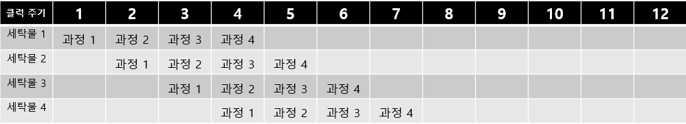

### name : 윤현식

## lec 1

### linux command

1. ls
   * 어떤 파일이 있는지 보는 명령, 현재 directory에 있는 리스트를 보는 명령.
#

2. pwd
   * 현재 directory가 어디인지 보여주는 명령.
   #

3. hostname
   * 내가 지금 어떤 컴퓨터를 쓰고 있는지 알려주는 명령.
   #

4. ssh
   * 원격지 호스트 컴퓨터에 접속하기 위해 사용되는 인터넷 프로토콜.
   #

5. who
   * 이 컴퓨터에 누가 있는지 확인하는 명령.
   #

6. wc
   * word count의 준말. **줄 단어수 캐릭터수** 로 구성됨.
   #

7. mkdir
   * directory를 만드는 명령.
   #

8. cd
   * change directory의 준말. 작업하는 directory를 옮기는 명령.
   #

9. ls -l
   * 파일을 ls 보다 상세히 보여주는 명령어.
   #

10. ls -al
    * 모든 파일을 보여주는 명령어
    * .으로 시작하는 파일은 **히든 파일** 이므로 ls -l에서는 나타나지 않음.
    * 그러므로 교수님께서 ls -al 혹은 ls -la를 습관화 하라고 말씀하심.
   #

11. vi + 파일명
    * vi editor를 실행하는 명령어
    1. normal mode
      * 들어가면 가장 먼저 작동하는 모드로, 이때 키보드 입력은 명령이 된다.
    2. insert mode
      * i 혹은 insert를 입력하여 모드 변경을 할 수 있으며, 키보드를 통해 문서 편집이 가능해진다.
    3. command mode
      * insert mode에서 esc를 통해 이동할 수 있다. 화살표로 문서를 이동할 수 있다.
      * delete 또는 x를 통해 한 글자를 지울 수 있다. 
      * u를 통해 실행취소를 할 수 있다.
      * a를 통해 커서 위치 다음 위치에서 insert mode로 변경할 수 있다.
      * :를 통해 커서를 밑으로 떨어뜨리고 w로 저장, q로 종료할 수 있다.
   #
      
12. cc + 파일명
    * 컴파일을 해주는 명령어.
   #

13. a.out
    * 실행파일로써 ./와 함께 붙여서 실행해야되는 명령어. ./는 현재 directory에 있다는 의미.
   #

14. passwd
    * 비밀번호 변경하는 명령어.
   #

15. chmod
    * 분석: dr--r-----   2 pcc039 pcc   4096  1월   4 15:35 forAll 의 경우
   이 파일의 이름이 d로 시작하므로 directory 입니다. 이 파일의 소유자는 pcc039입니다. pcc라는 그룹에 속해져 있습니다. 이 파일은 그룹원의 경우 read만 할 수 있으며 다른 사람들은 이 directory를 write, read, execute 할 수 없습니다.
    * d: 종류, rwx를 한 묶음으로 각각 8진수 체계로 421이 할당. 그러므로 모든 권한을 오픈하고 싶을 경우 전부 더해서 7이 됨. 일례로 w를 막고 싶은 경우 5를 입력하면 됨.
    * chmod 777은 전체를 오픈하게 됨.
    * chmod 770은 자신을 포함한 그룹원에게만 권한을 오픈.
    * chmod 700은 소유자에게만 권한을 오픈.
    * chmod +x (파일명) 과 같이 입력하여 부분적으로 허용할 수도 있음.
   #


## lec02
### Computer Hardware & Software System

* CPU (Intel, AMD.)
* Memory (RAM)
* Output Devices
* Storage Devices (DISK)
* Input Devices 
* buffer
    * iobuffer (input, output device에 관여하는 buffer)

### Linux Software

* HardWare
* Linux: Kernel
* System Call: Interface
* System Utilities: cat, ls, date, ps, kill, who
* Linux Shell: bash, tsch, zsh, pdksh

### Linux kernel SCI (System Call Interface)

**그림에서 위쪽으로 갈수록 sw, 아래로 갈수록 hw.**
* Terminal (단말기): 사용자와 컴퓨터 시스템 간의 마지막 관계 -> 사용자 바로 앞의 기계 -> input, output 둘다 가능함. 
* Character deivce: 문자 장치
* 리눅스는 모든 디바이스가 파일이다.

### 컴퓨터의 구성요소 4가지
* 데이터, 소프트웨어, 하드웨어, 사용자

### Linux system & command
 <br>
**C는 캐릭터 디바이스. l은 slink. 여기서 디바이스 pts가 14인 파일을 소유하고 있는 tty 그룹은 write할 수 있고, 나머지는 permission 할 수 없음.**

* shell에서 가장 기본이 되는 input과 output 장치: 표준입출력장치(stdio)

1. wall
   * 모든 사람에게 메세지를 보내는 명령어.
1. write + (대상)
   * 대상에게 메세지를 보내는 명령어.
1. mesg n
   * 메세지 차단.
1. man
   * manual의 약자로 명령어의 사용법을 알려주는 명령어.
1. ctrl + c
   * kill의 효과를 가지고 있는 명령어.
1. ctrl + d
   * 파일을 끝내는 명령어.
1. cp
   * 파일과 디렉토리를 복사할 수 있는 명령어.
1. mv
   * 파일과 디렉토리를 옮기는 명령어.
1. ps
   * 현재 돌아가고 있는 process를 확인할 수 있는 명령어. -al을 붙이면 숨겨진 파일까지 확인 가능.
1. vi
   1. (command mode) set number: 라인 넘버를 달아주는 명령어.
   1. (normal mode) /+[찾고자 하는 것]: 찾고자하는 것을 찾아주는 명령어.
   1. (normal mode) o: insert 모드를 진입하면서 한줄 내려가는 명령어.
1. sleep 10 ; echo 10
   * 10초 후 10을 출력하는 명령어.
   * echo는 문자열을 컴퓨터 터미널에 출력하는 명령어.
1. cat
   * 파일이 없을 경우: standard input을 받고 standard output으로 내보냄.
   * 파일이 있을 경우: 두개의 파일을 혼합함.
      * ex) cat data.txt hello.c output.txt > total.txt: 앞의 3개 파일의 결과를 total.txt에 저장.
1. fg %(number)
   * (number) 작업을 fore ground 작업으로 실시하는 명령어.
1. ()&
   * 작업을 back ground로 실시하는 명령어.
1. strings
   * 읽을 수 있는 데이터만 보여주는 명령어.
1. Redirection
   * stdioin, stdioout, stdioerr
   * < == 0<: 파일의 데이터를 명령에 입력.
   * '>' == 1>: : 명령의 결과를 파일로 저장.
   * 2>: stderr을 내보내는 명령어.
      * ex) cat hello.c hello.cpp 1> out.txt 2> err.txt: 이렇듯 에러를 저장하려면 2>을 사용해야함. (이때, hello.cpp라는 파일은 존재하지 않음.)
      
   * '>>': 명령의 결과를 파일에 추가. (기존의 것들이 삭제되지 않음.)


## lec03

### linux command
1. which (찾고자 하는 것)
   * 파일이 어디있는지 알려주는 명령어.
1. grep
   * 입력으로 전달된 파일의 내용에서 특정 문자열을 찾고자할 때 사용하는 명령어.
1. tee
* 
   *  명령어의 출력 결과를 파일과 화면에 동시에 출력할 수 있도록 해주는 명령어. stdin을 받아서 stdout과 하나 이상의 파일에 그 입력을 출력.

 ```
 cp ~hwan/.profile ~hwan/.bashrc ~hwan/.bash_logout ~
 source .profile
 ```
 교수님 코드를 카피하여 프롬프트가 초록색이 됨. 또한 path에 .이 추가되어 a.out만 입력해도 실행됨.


### md 사용법
* 제목: #
* 제목 2단: ## -> 제목 6단까지 가능. 
* *은 리스트를 만들 때 유용, Tab을 써서 구분
* <b.r> 을 통해 줄 구분. (.제외)
* 1.을 통해 번호를 매길 수 있으며, 1만 써도 자동으로 번호가 카운트. tab을 하면 다른 리스트로 분류되어 숫자가 리카운트.
* 순수하게 1.을 쓰고 싶다면 1과 .사이에 \ 넣으면 됨.
* ** ** 사이에 글자를 넣으면 bold 되고 * * 사이에 넣으면 이태리체가 됨. *** ***은 이태리 bold가 됨.
* 글자 끝에 #을 넣어 줄 구분.

### git command
* git clone https://git.ajou.ac.kr/sw_hyeonsik/pcc020.git
   * 해당 git 사이트에 있는 소스코드를 복제하여 내 컴퓨터에 가져옴.
* git pull
   * 원격 저장소에서 로컬 저장소로 소스를 가져오는 명령어.
* git add
   * 작업 디렉토리(working directory) 상의 변경 내용을 스테이징 영역(staging area)에 추가하기 위해서 사용.<br>다음 변경(commit)을 기록할 때까지 변경분을 모아놓기 위해서 사용.
* git commit -m ""
   * commit은 파일 및 폴더의 추가/변경 사항들에 대해 기록을 하는 것, 작업공간 안에 있는 모든 파일과 파일의 데이터를 사진 찍듯이 복사해서 저장소에 보존. 즉 커밋은 작업공간의 어떤 시점의 스냅샷.
   * -m을 통해 editor 실행X.
   * "" 사이에 말을 추가 가능.
* git config
   * 원격 저장소로 데이터를 넘길때 커밋한 사람이 누구며, 어떠한 사람인지 남길 필요가 있다. 이런 인증에 대한 부분을 git config 명령어로 설정.
>* $ g it config --global user.name "sw_hyeonsik" <br>
$ git config --global gustlrehfud@ajou.ac.kr
* git push
   * 현재 프로젝트의 커밋된(HEAD) 내용을 원격 저장소로 내보내는 명령어입니다.
* git mv
   * git에 있는 파일의 이름을 바꾸는 명령어.
* git rm
   * 로컬 디렉토리와 git 저장소 모두에서 파일을 삭제.


### fork, branch 차이점
* fork는 다른 사람의 Github repository에서 내가 어떤 부분을 수정하거나 추가 기능을 넣고 싶을 때 해당 respository를 내 Github repository로 그대로 복제하는 기능이다. <br>
즉 Repository에 권한이 없는 사용자가 저장소를 fork하고 fork한 자신의 저장소에 변경 사항을 적용한 후 Push한다. 이 후 원래 저장소(original repository)에 내 저장소에 있는 브랜치를 Pull Request 한다. 내가 만든 코드가 ok되면 해당 저장소에 Merge 된다. <br>
-> 또 다른 프로젝트를 만들 때 사용.
* 은 특정 repository를 내 local machine에 복사하여 새로운 저장소를 만든다. clone한 원본 repository를 remote 저장소 origin으로 가지고 있다. 권한이 없는 경우 해당 저장소로 push 하지 못한다. <br>
->소규모 팀에서 활용 가능한 예, 프로젝트를 수정할 때 사용.


## lec04

### understanding redirection 
* < = 0<, << = 0<<, > = 1>, >> = 1>>, 2> = 2>>
* echo hello > /tmp/out - hello를 tmp/out에 저장. <br>
= echo > /tmp/out hello <br>
* echo hell0 >&2 - stdout, stderr 둘다 내보낸다. <br>
= echo >&2 hello
* read -r line < file - file의 한 줄을 읽는다. <br>
= < file read -r line
* 단축코드
    * mycomn > outfile 2>&1 을 줄여서 mycomn &> outfile
    * mycomn >> outfile 2>&1 을 줄여서 mycomn &>> outfile
    * mycomn1 2>&1 | mycomm2 을 줄여서 mycomm1 |& mycomm2
    * https://mug896.github.io/bash-shell/redirections.html
### Here document, Here String
* 0<<, <<
    *  임시 파일을 만들어 stdin으로 연결. <br>
    ```
    $cat << EOF
    > "200"
    > EOF
    "200"
    ```
* <<< (bash only)
    * string을 stdin 입력으로 연결.
    ```
    $ cat <<< *
    *
    ```
### Pipe Oreder of execution
* 실행의 순서는?
    * $ cmd1 | cmd2
        * cmd1과 cmd2는 동시에 병렬로 실행된다.
        * cmd1이 cmd2보다 빠르면 파이프에 write은 블록되고 더이상 진행되지 않는다.
        * cmd2가 cmd1 보다 빠르면 파이프로부터의 read는 블록된다.
        * cmd1이 먼저 종료하면 파이프는 close 되고 cmd2는 End-Of-File 로 인식해 종료한다.
        * cmd2가 먼저 종료하면 파이프는 close 되고 cmd1은 다음번 write에 SIGPIPE 신호를 받게되고 종료된다.
### Named pipe
* pipe는 자동으로 생성/소멸
* Named pipe
    * mkfifo 명령으로 생성 - 파일처럼 생성됨.
    * redirection으로 sending
* 읽는 상대편이 없으면 Block 된다.
* Buffer Control이 필요.

### linux command
* ????*
    * 이름이 4글자 이상인 파일들을 모두 보여주는 명령어.
* echo [abc]*
    * 이름이 a, b, c로 시작하는 파일들을 모두 보여주는 명령어.
* echo [a-q]*
    * 알파벳 사전순으로 a~q까지의 알파벳으로 시작되는 파일을 모두 보여주는 명령어.

### Standard signed integer type
* signed char, short int, int, long int, long long int
* Unsigned
    * Unsigned ..
* floating type
    * flout, double, (long double)
* Definition in standard
    * char - large enough to store any execution character set.
    * floating - The set of values of the type float is a subset of the set of values of the type double; the set of values of the type double is a subset of the set of values of the type long double.
* _complex
* _Bool
    * can store 0, 1

### Negative integer
* 3 Well know methods to represent signed integer
    * the corresponding value with sign bit 0 is negated (sign and magnitude);
    * the sign bit has the value - (2M)(two's complement);
    * the sign bit has the value (2M-1)(one's complement).
* Which method is used in C Language?
    * All three are possible.
    * 근데 대부분은 2's complement를 사용.
    * 2'complement
        * 1의 보수(~)를 구한 후, 가장 낮은 비트에 +1
     
### Unsigned int
* un-sign-ed 라는 것은 결국 "부호가 없다"는 뜻이고, 그래서 항상 플러스 값만 가짐.
* %u를 통해 출력.

### 시프트 연산
* '>>': /2
* '<<': *2

### signed int 와 unsigned int에서 시프트 연산의 차이
```
int in_a, in_b;
fscanf(stdint, "%d", &in_a);
in_b = in_a >> 2;
```
signed int의 경우 a에 음수 값을 넣고 오른쪽으로 두칸 이동할 때 남는 공간에 1이 채워진다. 양수 값일 경우 0이 채워짐.
```
unsigned int in_a, in_b;
fscanf(stdint, "%d", &in_a);
in_b = in_a >> 2;
```
unsigned int의 경우 a에 음수 값을 넣고 오른쪽으로 두칸 이동할 때 남는 공간에 0이 채워짐. 양수 값일 경우 1이 채워짐.

나누기 연산에서도 같은 현상이 일어남.

## lec05
### signed와 unsigned의 fscanf 입력
```
#include <stdio.h>
int main()
{
    signed int siA;	
	unsigned int unA;
	signed int sumS;
	unsigned int sumU;
	fscanf(stdin, "%d", &siA);
	fprintf(stdout, "Signed Inteager : %d\n", siA);
	unA = siA;
	fprintf(stdout, "Unsigned Inteager : %u\n", unA);
	fprintf(stdout, "Unsigned Inteager percent d : %d\n", unA);
	fprintf(stdout, "Unsigned Inteager percent d : %u\n", siA);

    sumS = siA + unA;
    sumU = siA + unA;
	fprintf(stdout, "sumS %%d %d\n", sumS);	
	fprintf(stdout, "sumS %%u %u\n", sumS);	
	fprintf(stdout, "sumS %%d %d\n", sumU);	
	fprintf(stdout, "sumS %%u %u\n", sumU);
```

 <br>
위 사진은 코드를 실행하고 100, -100을 넣은 결과이다.
unsigned int로 선언했더라도 출력시 %d로 받는다면 signed 형태로 받아서 나온다. 그래서 -100을 넣어도 -200이라는 sumS, sumU 출력값이 나온다.<br>
<br>
위 사진은 코드를 실행하고 4294967200을 넣은 결과이다. <br>
근데 결과를 보면 Signed int가 -96이 나온 것을 볼 수 있다. 오버플로우가 일어나지 않은 이유가 무엇일까? 우선 4294967200이 2진수로 변환하면 11111111111111111111111110100000이 된다. 그리고 scanf에 %d가 들어가면 내부적으로 strtol이 호출되는데, 이것은 변환대상이 최대값을 넘어갈 경우 long_max(0x7fffffff)을 반환한다. fscanf도 마찬가지로 내부에서 strtol 함수를 호출해서 오버플로우 현상이 일어나 입력값을 2147483647로 구겨넣는다. 하지만 64 bit os의 최대값은 0x7fffffffffffffff임으로 오버플로우가 일어나지 않는다. 그러므로 2진수로 변환된 11111111111111111111111110100000이 그대로 들어간다. 이 숫자는 96의 2의 보수이기 때문에 -96이 들어가게 되는 것이다.  <br>
반면 unsigned int는 정상 출력이 되는 것을 확인 할 수 있는데 이는 unsigned int의 범위가 0~4294967295까지이기 때문이다.

### Count number of 1 (binary)
```
#include <stdio.h>

//Count number of 1 (binary)
int count_one(int in_a)
{
        int i, count = 0;
        for(i = 31; i>=0; i--)
        {
                if((in_a>>i) & 1)
                        count++;
        }
        return count;
}

int main()
{
        int i;
        unsigned int in_a;
        fscanf(stdin, "%u", &in_a);
        fprintf(stdout, "%u \t: ", in_a);
        for(i=31; i>=0; i--)
        {
                fprintf(stdout, "%d", ((in_a>>i) & 1));
                if(i % 4==0)
                {
                        fprintf(stdout, " ");
                }
        }
        fprintf(stdout,": %d \n", count_one(in_a));
}
```
위 코드를 보면 main 함수에서 unsigned int인 in_a를 선언하고 이를 1과 & 연산을 하여 in_a의 이진수를 구한다. 그리고 if(i%4==0)이라는 조건문을 통해 4개 단위로 볼 수 있도록 출력한다. 그리고 count_one 함수에 in_a를 전달하여 똑같이 2진수 형태로 바꾸고 count += (in_a>>i)&1 연산을 통해 1의 개수를 구하고 리턴하여 main 함수에서 출력한다. <br>
하지만 코드를 좀 더 빠르게 하기 위해
```
int count_one(int in_a)
{
        int i=32, count = 0;
        while (i>0)
        {    
            count += (in_a>>i) & 1;
            i--;
        } 
        return count;
}
```
위 사진과 같이 함수를 수정하여 나타낼 수 있다. if문은 operation이 오래걸리기 때문이다. 

 <br>
사진과 같이 10과 -1을 넣었을 때 결과값을 확인할 수 있다. 이때 -1을 넣었을 때는 in_a의 출력값이 4294967295가 나오는 이유는 in_a가 unsigned int로 선언되어있기에 -1의 2진수가 그대로 들어갔고 이것이 오버플로우 없이 그대로 출력되었기 때문이다.

### The basic memory model in C 
* automatic variable (자동변수)
    * 자동 변수는 현재 블록이 끝나면 사라집니다. 즉, 변수가 생성된 뒤 자동으로 사라진다고 해서 자동 변수(automatic variable)라 부릅니다. 
* static variable (정적변수)
    * 함수 내부 및 전역에서도 사용가능하며, 각각 내부정적변수, 외부정적변수라고 불린다. 또한 0으로 자동으로 초기화된다. 프로그램 실행 시 할당되고, 자동변수와는 다르게 함수가 끝나도 그 값을 기억한다. 그리고 프로그램이 종료시 파괴된다.

* const
    * constant의 약자로 "변함없는" 이란 뜻으로 변수 앞에 붙이면 값을 변경하지 못하도록 하며, 해당 변수를 상수로 취급하게 됩니다.

## lec06
###linux command
* alias
    * 자주 사용하는 명령어를 특정 문자로 입력해두고 간편하게 사용하기 위한 것으로 command alias라고 함. <br>
    alias = cc='cc-Wall' 이런식으로 사용 가능.
    * alias -p를 통해 확인 가능.
    * unalias를 통해 해제 할 수 있음. 이때, unalias -a은 모든 alias 설정을 삭제.
    * alias 설정한 것을 사용하고 싶지 않을 때는 \ls 처럼 \를 붙여 사용.
* cc && a.out
    * 컴파일 후 문제가 없을 경우 a.out을 실행하는 명령어.
* cc ; a.out
    * 컴파일 후 a.out을 실행하는 명령어. 이때 컴파일 에러가 발생하면 가장 최근에 컴파일 성공한 a.out의 결과를 출력. 
* cc || echo "Errrr"
    * 컴파일 에러가 날 경우 echo의 결과를 출력해주는 명령어.

### Pointer Basic
* &val - val의 주소.
    * %lld로 받음.
* *ptr - val 주소의 값.
    * *&a는 a가 가리키는 주소의 값.


* increment
    * int *a; // a++ increment by 4
    * long long *b; // b++ increment by 8
    * void *c; // c++ increment by 1

```
#include <stdio.h>

void add(int *a, int *b, int *c)
{
        *c = *a + *b;
}

int main()
{
        const int a = 100;
        int b = 200;
        const int c = 999;

        fprintf(stdout, "%d : %lld\n", a, &a);
        fprintf(stdout, "%d : %lld\n", b, &b);
        add(&a,&b,&c); //2
//      c = a+b; //1
        fprintf(stdout, "%d : %lld\n", c, &c);
        int d=999;
        fprintf(stdout, "%d :%lld  %lld\n", d, ((void *)(&d))+1, &d+1);
                }

```
위 코드의 경우 c를 1번과 같이 구할 경우와 2번으로 구하는 경우가 다르다. add함수로 갈 경우 c의 주소의 값을 수정하는 것이기 때문에 오류가 발생하지 않지만 1처럼 그냥 수정하려고 한다면 const int이기 때문에 오류가 발생한다. 마지막 fprintf 에서 자료형을 int에서 void로 바꾸어주는데 이 때문에 메모리 크기가 4에서 1로 바뀌고 &d+1 은 메모리 주소가 int와 다르게 1만 증가하게 된다.<br>
또한 add 함수에서 *b = *(a+1) 와 같이 나타낼 수 있는 것은 이것들이 메모리 주소 형태로 들어왔기 때문에 가능하다.

### int an_array[ ] vs int *a_pointer 
* int an_anrray[32]; (이건  int로 저장되서 4 byte, an_array 자체는 8byte 공간에 저장.)
    * Program will do;
    * set aside a space on the stack big enough for 32 integers, and
    * declare that an_array is a pointer, and
    * bind that pointer to point to the newly allocated space.
* int *a_pointer;
    * Just pointer;
    * a_pointer = malloc(32*4);

```
#include <stdio.h>

int sumArray3(int a[3], int sum)
{
        sum = *a;
        a++;
        sum += *a;
        a++;
        sum += *a;
        fprintf(stdout, "%d : %lld %llx\n", sum, &sum, &sum);
        return a[3];
}

int main()
{
        int a=100;
        int b = 200;
        int c = 999;
        int arr[4] = {100,200,300,400};
        int *parr;
        parr = arr;
        parr++;
        fprintf(stdout, "%d : %lld %lld\n", *parr, parr, arr);
         c = sumArray3(arr, b);
        fprintf(stdout, "%d : %lld %llx\n", b, &b, &b);

        fprintf(stdout, "%d : %lld %llx\n", *arr, *arr, *arr);
        fprintf(stdout, "%d : %lld %llx\n", &arr, &arr, &arr);
        fprintf(stdout, "%d : %lld %llx\n", arr[2], &arr[2], &arr[2]);
        fprintf(stdout, "%d : %lld %llx\n", arr[3], &arr[3], &arr[3]);
        fprintf(stdout, "%d : %lld %llx\n", arr[4000], &arr[4000], &arr[4000]);

}

```
위 코드를 처럼 arr 배열을 선언하여 출력하면 <br>
 
* 위 사진과 같은 결과를 얻을 수 있다. 이 사진이 의미하는 것은 우선 arr가 각각 %d, %lld로 출력될 때 각각의 주소값의 int 값과 본래 값인 140735337148832이 출력된 것을 볼 수 있다. 
* 또한 바로 밑에 arr[2]가 출력된 것을 보면 주소가 8 증가한 것으로 보아 int arr로 선언되었기에 메모리 값이 4씩 증가하는 것이 확인된다. 
* main함수에서 sumArray3 함수로 arr, b를 보내지만 b의 값은 바뀌지 않고 sum이라는 변수가 하나 생기게 된다. b는 Call by value이기 때문에 값이 보존되어 또 다른 sum이라는 변수가 생성되는 것이다. 또한 a의 주소 변경을 통해 값을 바꿀 수 있는 것을 sum += *a; a++;을 통해 알 수 있다. 
* 마지막으로 arr은 const이기 때문에 arr++;처럼 직접 바꾸려고 하면 에러가 발생한다. 그러므로 int *parr과 같이 따로 포인터를 만들어서 해야된다.

### Call by value, Call by reference의 차이
* Call by value(값에 의한 호출)는 인자로 받은 값을 복사하여 처리를 한다. Call by reference(참조에 의한 호출)는 인자로 받은 값의 주소를 참조하여 직접 값에 영향을 준다. 간단히 말해 값을 복사를 하여 처리를 하느냐, 아니면 직접 참조를 하느냐 차이인 것이다.
                
### Pointer / Address
>* Noun-Adjective Form
    int const A constant integer <br>
    int const * A (variable) pointer to a constant integer <br>
    int * const A constant pointer to a (variable) integer <br>
    int * const * A pointer to a constant pointer to an integer <br>
    int const * * A pointer to a pointer to a constant integer <br>
    int const * const * A pointer to a constant pointer to a constant integer <br>

## lec07
### int const * 와 int * const의 차이
 ```
 #include <stdio.h>
 void add(int *a, int *b, int *c)
 {
     *c = *a + *b;
 }
 int main()
 {
     int const a = 100;
     int b = 200;
     int c = 9999;
     int const * p = &a;
     fprintf(stdout, "a, b ,c : %d %d %d\n", p, b, c);
     p = &b;
     fprintf(stdout, "a, b ,c : %d %d %d\n", p, b, c);
 }
```
* int const * 는 const int형을 가리키는 포인터로 포인터 값은 변경이 가능하므로 다른 것을 가리킬 수 있으나 내부의 int 값은 const로 선언되어 변경이 불가능합니다.
* int* const 는 const 포인터가 int형을 가리키고 있으므로 포인터의 값은 변경이 불가능하고 내부의 int형으로 표현된 값은 변경이 가능합니다. 

### 함수의 Pointer
```
#include <stdio.h>
//code by hyeonsik

void add( int *a, int *b, int *c)
{*c = *a + *b;}

void sub(int *a, int *b, int *c)
{*c = *a - *b;}

void div( int *a, int *b, int *c)
{*c = (*a) / (*b);}

void mul( int *a, int *b, int *c)
{*c = (*a) * (*b);}


int main()
{
        int a = 100;
        int b = 200;
        int c = 9999;
        char ch;
        int op = 0;

        scanf("%d %c %d", &a, &ch, & b);
        // ch = + add, - sub, * mul, /div
        switch (ch)
        {
                case '+':
                        op = 0;
                        break;
                case '-':
                        op = 1;
                        break;
                case '*':
                        op = 2;
                        break;
                case '/':
                        op = 3;
                        break;
        }


        void (*fp[4])(int *, int *, int *) = {add, sub, mul, div};

        if(op == 0)
        {
                fp[0](&a,&b,&c);
                fprintf(stdout, "%d\n", c);
        }

        if(op == 1){
                fp[1](&a,&b,&c);
                fprintf(stdout, "%d\n", c);
        }
        if(op == 2){
                fp[2](&a,&b,&c);
                fprintf(stdout, "%d\n", c);
        }
        if(op == 3){
                fp[3](&a,&b,&c);
                fprintf(stdout, "%d\n", c);
        }
        fprintf(stdout, "fp %lld %lld %lld %lld", add, sub, mul, div);
}
```
```
// 교수님께서 수정해주신 것.
#include <stdio.h>
#define FN_ADD 0
#define FN_SUB 1
#define FN_MUL 2
#define FN_DIV 3

void add(int *a, int *b, int *c)
{ *c = *a + *b; }

void sub(int *a, int *b, int *c)
{ *c = *a - *b; }

void mul(int *a, int *b, int *c)
{ *c = (*a) * (*b); }

void div(int *a, int *b, int *c)
{ *c = (*a) / (*b); }

int main()
{
        int a, b, c;
        char ch;
        int op = FN_ADD; // default is add

        scanf("%d %c %d", &a, &ch, &b);

        void (*fp[4])(int *, int *, int *) = {add, sub, mul, div};
        switch (ch)
        {
                case '+':
                        op = FN_ADD;
                        break;
                case '-':
                        op = FN_SUB;
                        break;
                case '*':
                        op = FN_MUL;
                        break;
                case '/':
                        op = FN_DIV;
                        break;
                default :
                        op = FN_ADD;
                        break;
        }

        fp[op](&a,&b,&c);
        fprintf(stdout, "%d \n", c);

        fp[5](&a,&b,&c);
        fprintf(stdout, "%d \n", c);

        // int const * p = &a;
        // int * const q = &a;
}
```
* 함수의 주소를 저장했다가 해당 주소의 함수를 호출할 때 사용한다.

* void (*fp)와 같이 선언한다.

* 배열은 (*fp[4])와 같이 선언한다.

* #define과 const의 차이점
    * #은 preprocessor
    * const는 타입을 가지므로 보다 표현 범위와 구조에 대해 명확하게 됩니다. 
    * const에는 메모리가 할당됩니다. 컴파일러로 하여금 그 영역에 덮어쓰는 작업을 막도록 감시하게 해 줄 뿐이지 
    주소를 직접 건드리면 const의 값 마져 변경시킬 수 있습니다.
 
### gcc compile options

### gcc compile - for multiple file
* exetern
    * 외부 파일에서 선언된 변수를 사용.
<br>

* 위 사진과 같이 코드를 짜고 gcc main.c func.c를 하게 되면 우선 #(preprocessing)이 일어나 stdio 와 func.h를 불러옵니다. 그래서 main함수에서 DF == ((a)*(a))가 되고 func.h에 있는 extern에 의해서 func.c에 있는 func1이 호출됩니다. 만약 extern이 없으면 func.c에 있는 함수를 사용할 수 없습니다.
* cc -c main.c
    * main.c를 main.o로 만들어주는 명령어.
* .o 파일
    * c 소스 프로그램을 컴파일 할 때 생기는 목적 코드 파일. 기계어로 이루어져있다.
    * cc main.o func.o를 하여도 정상적으로 a.out이 생성된다. 왜냐하면 .o에서 링크 단계를 거치면 a.out이 생성되는 것이기 때문이다.

### C Preprocessor (CPP)
* Macro Processor for C, C++, Objective-C
    * Include head files
    * Define macro
    * Conditional Compliation
    * Line Control

### CPP - include file
* #include file as text
    * #include <stdio.h> or "file.h"
* gcc Option - I
    * Include location - ./usr/include/
    * Default include location
* Prevent multiple include
    * #pragma once (두번 로딩 안함)
    * #ifndef _MATH_ <br>#include <math.h>
    <br>#endif

### CPP - Conditional Compilation
* #if, #ifdef, #ifndef, #elif, #else, #endif

* Select code with condtion
```
    * #ifdef _VERSION_<br>
      #if _VERSION_ >= 3<br>
        printf("Version is greater or equal than 3\n");<br>
        #elif _VERSTION_ == 2<br>
        #error VERSTION 2 IS NOT SUPPORTED<br>
        #endif<br>
        #endif // idfef _VERSION_
```
### Marco Definition
<br>

### 과제: if문을 이용하여 조건부 컴파일하기
```
//func.c
#define __FUNC_ 0
#define FUNCTION_NEGATIVE
extern int fun1(int x);
extern int fun2(int x);

#if __FUNC_ == 0
int func1(int a)

{
        return(a*10);
}

int func2(int a)
{
        return DF(a+1)*20;
}
#else

int func3(int a)
{
        return DF(a+2)*20;
}
#endif
```

```
// func.h
#ifndef __FUNC_

#if FUNCTION_NEGATIVE == 1
#define DF(a) (-(a)*(a))
#else
#define DF(a) ((a)*(a))
#endif

extern int func1(int x);
extern int func2(int x);
extern int func3(int x);

#endif
```
```
// main.c
#include <stdio.h>
#define FUNCTION_NEGATIVE 1
#include "func.h"
#define __FUNC_
int main()
{
        printf("func1 %d %d\n", func1(100), DF(10));// func 110 100

        printf("func2 %d %d\n", func2(100), DF(10));// func 110 100

}
```
* #if와 endif는 항상 짝을 이루어야함.
* func.h에서 extern을 통해 func.c에 있는 func1, func2, func3을 사용합니다.
* func.c에서 ```#if __FUNC_ == 0```과 #else를 통해 0일 때는 fun1, fun2의 함수를 반환하고 그 외에는 func3의 함수를 반환한다. 이때 ```__FUNC_``` 을 0 이라고 정의 해놓았기 때문에 #else 밑은 컴파일 되지 않는다.
* 그리고 main.c에서 fun1, fun2의 함수에 대입하여 결과값을 출력한다.

## lec08
### Special Macro and Directives
* ```__FILE__```
    * 파일 이름을 나타낸다.
    * %s
* ```__LINE__```
    * 줄 번호를 나타낸다.
    * %d

### Token stringication
```
#define str(s) #s
str(p = "foo\n";) // outputs "p = \"foo\n\";"
str(\n) // outputs "\n"

#define xstr(s) str(s)
#define str(s) #s
define foo 4
str (foo) // outputs "foo"
xstr (foo) // outputs "4" 
```
### Token Concatenation
```
#define DELARE_STURCT_TYPE(name) typedef struct name##_s name##_t

DECLARE_STRUCT_TYPE(g_object);
// Outputs: typedef struct 
g_object_s g_object_t;

#define CAT(a,b) a##b
#define sq(a) a##a##a
sq(C) // Outputs: CCC

// 다른 예제
#define COMMAND(name) {#name, name ## _command}
COMMAND(quit) // -> {"quit", quit_command}
```

### GCC Optimization
* -O0(기본값)
    * 최적화를 수행하지 않는다.
* -O, -O1
    * 코드 크기와 실행 시간을 줄이는 것을 제외한 최적화는 실행하지 않는다.
* -O2
    * 메모리 공간과 속도를 희생하지 않는 범위내의 모든 최적화를 수행한다. (loop unrolling과 function inlining에 대한 최적화를 수행하지 않는다.)
* -O3
    * -O2 최적화에 인라인 함수와 레지스터에 대한 최적화를 추가로 수행한다.
        * 인라인 함수: 실행을 해보면 일반 함수와 다르지 않지만 다음과 같이 인라인 함수는 호출을 하지 않고 함수의 코드를 그 자리에서 그대로 실행합니다. 즉, 컴파일러는 함수를 사용하는 부분에 함수의 코드를 복제해서 넣어줍니다. 즉, 함수 호출 과정이 없으므로 속도가 좀 더 빠릅니다.
        ```
        #include <stdio.h>
        inline int add(int a, int b)
        {
            return a+b;
        }
        int main()
        {
            int num1;
           /*
            num1 = inline int add(10, 20)
            {
                return 10 + 20;
            }
            */
            // 주석 부분을 컴파일러가 함수를 복제해서 넣어줌!
            printf("%d", num1);
        }

* -Os
    * -O2 최적화 기능을 사용하지만, 코드 크기를 증가시키는 최적화는 생략한다.

### .o .s file


### gcc option
* gcc -o (실행파일명) (파일명)
    * 실행파일명으로 실행파일을 만든다.
* gcc -E
    * 전처리 과정의 결과를 화면에 보이는 옵션 (전처리과정 중 발생한 오류를 검증)
* gcc -S
    * cc1으로 전처리된 파일을 어셈블리 파일로 컴파일까지만 수행하고 멈춘다. (*.s)

* gcc -c
    * as에 의한 어셈블까지만 수행하고 링크는 수행하지 않는다. 오브젝트 파일 생성 (*.o)

### Macro Definition (2)
* Multiple lines
    * ```
        #define NUMBERS 1, \
                        2, \ 
                        3
        ```
    * ```
        int x[] = { NUMBERS }; 
        //int x[] = {1,2,3};
      ```
* Define Where?
    * ```
        foo = X;
        #define X 4
        bar = X; // foo = X and bar = 4
      ```
    * ```
        #define TABLESIZE BUFSIZE
        #define BUFSIZE 1024
        // TABLESIZE == BUFSIZE ==1024
      ```
    * ```
        #define BUFSIZE 1020
        #define TABLESIZE BUFSIZE
        #undef BUFSIZE
        #define BUFSIZE 37 // TABLESIZE = 37
      ```
### Macro Definition (3) - Function like Macro
* ```
    #define min (X, Y) ((X) < (Y) ? (X) : (Y))
    x = min(a,b); -> ((a) < (b) ? (a) : (b));
    y = min(1,2); -> ((1) < (2) ? (1) : (2));
    z = min(a + 28, *p) -> z = ((a+28) < (*p) ? (a+28) : (*p));
    // if문 보다 성능이 좋음.
  ```
### 실습 1
```
#include <stdio.h>

void add( int *a, int *b, int *c)
{
        *c = *a + *b;


int main()
}
        int a=100;
        int b = 200;
        int c = 999;
        // int * == long long
        fprintf(stdout, "%d : %lld %llx\n", a, (long long) &a, (long long) &a);
{
        fprintf(stdout, "%d : %lld %llx\n", b, (long long) &b, (long long) &b);
        add(&a, &b, &c);
        fprintf(stdout,"%s %d : %d :\n ", __FILE__, __LINE__, c);
        fprintf(stdout,"%s %d : %d : \n ", __FILE__, __LINE__, c);
        fprintf(stdout,"%s %d : %d : \n ", __FILE__, __LINE__, c);
#define ERR_DATA 1000
#if ERR_DATA > 1000
#error 1024
#else
#warning ERR_DATA
#endif
        fprintf(stdout,"%s %d : %d :\n ", __FILE__, __LINE__, c);


}
```


* ```__LINE__```은 몇 번째 라인인지 알려주며, 재정의 할 경우 그 밑줄부터 다시 카운트한다.
* ```__FILE__```은 파일명을 출력한다. 해당 파일의 경우 이름이 hello.c이기 때문에 hello.c를 출력한다.
* &a와 &b가 longlong으로 정의되면 %lld로 출력될 때 warning이 발생하지 않는다.
* ERR_DATA를 1000이라고 했기 때문에 if 문에 걸리지 않고 else로 넘어가 waring문을 띄어준다.

##### 2시 1분 ~ 프젝 설명
* 아주대학교의 임베디드 시스템을 위한 고정소수점 수학 라이브러리 개발.
    * 임베디드 시스템: 특정한 목적을 가지고 만들어진 프로그래밍 가능한 모든 컴퓨터를 의미한다. 더 큰 시스템 내에서 특정 기능을 위해 설계된 기능으로 고정되거나 프로그래밍 가능한 컴퓨터 하드웨어와 소프트웨어의 조합이라 할 수 있다.
    * 고정소수점 표현 방식: 10진수를 2진수로 바꿨으면, 그걸 그대로 박아넣는 방식.
    * 부동소수점 표현 방식: 2진수로 변환한 결과를 그대로 박아넣지 않고 몇 가지 과정을 추가로 거친다.
        * 정규화(Normalization):  정수부에 1만 남을 때까지 소수점을 왼쪽 (*정수부가 0일 경우엔 오른쪽. 아래에서 다시 설명) 으로 이동시키고 이동한 칸 수만큼 n 자리에 집어넣으면 된다. 예를 들어서 111.101을 정규화하면 1.11101 * 2^2가 된다.
        * IEEE 754: IEEE 754의 부동소수점 표현은 크게 세 부분으로 구성되는데, 최상위 비트는 부호를 표시하는 데 사용되며, 지수 부분(exponent)과 가수 부분(fraction/mantissa)이 있다.
            * −118.625(십진법)를 IEEE 754(32비트 단정밀도)로 표현해 보자.
            * 음수이므로, 부호부는 1이 된다.
            * 그 다음, 절댓값을 이진법으로 나타내면 1110110.101(2)이 된다. 소수점을 왼쪽으로 이동시켜, 왼쪽에는 1만 남게 만든다. 예를 들면 1110110.101(2)=1.110110101(2)×2⁶ 과 같다. 이것을 정규화된 부동소수점 수라고 한다.
            * 가수부는 소수점의 오른쪽 부분으로, 부족한 비트 수 부분만큼 0으로 채워 23비트로 만든다. 결과는 11011010100000000000000 이 된다.
            * 지수는 6이므로, Bias를 더해야 한다. 32비트 IEEE 754 형식에서는 Bias는 127이므로 6+127 = 133이 된다. 이진법으로 변환하면 10000101(2)이 된다.
            * 

## lec09
### C언어 구조체(구조체 포인터 / typedef)
```
/// 구조체 정의
#include <stdio.h>

//구조체 정의
struct Student
{
  int id;
  int age;
  char * name;
};  // 세미콜론 확인

int main()
{                      //구조체 변수 선언
  struct Student stu;  //자료형 Student 의 변수 stu 선언 
                       
  stu.id = 1001;   //구조체 안 멤버에 접근하려면 . 연산자(직접접근)
  stu.age = 20;
  stu.name = "nano";

  printf("id : %d\n", stu.id);
  printf("age : %d\n", stu.age);
  printf("name : %s\n", stu.name);
  
  return 0;
}
```
```
// typedef는 기존의 존재하는 자료형에(구조체) 새 이름을 부여하는 것입니다.

typedef int InT; 
InT num=10;

int num=20; //기존 자료형도 물론 사용가능
```

### 프로젝트 관련 코드
```
#include <stdio.h>
// #### #### #### #### .  #### #### #### ####
// S 15 . 16
#define FX_Q_NUM 16
#define FX_2_MINUS_16 1.52587890625e-05F
#define FX_2_PLUS_16 (1<<16)
#define FX_S_15_15 11516
#define FX_SYSTEM FX_S_15_16

typedef int fixed32;

fixed32 fromFloat(float fa)
{
        return (fixed32)(fa * FX_2_PLUS_16);

}


float toFloat(fixed32 xa)
{
        return ((float) (xa)) * FX_2_MINUS_16;
}

fixed32 fxAdd(fixed32 a, fixed32 b)
{
        return fromFloat((toFloat(a) + toFloat(b)));
}
fixed32 fxAdd2(fixed32 a, fixed32 b)
{
        return a+b;
}
int main()
{
        long long i=0;
        int ia, ib, ic, ic2;
        float fa;
        fscanf(stdin,"%d %d", &ia, &ib);
        for(i=0; i<  64*256*256*256; i+=(256*256))
        {
                ic = fxAdd(i, i);
                ic2 = fxAdd2(i, i);
                //fprintf(stdout, "%d + %d : %d\n", ia, ib, ic);
                fprintf(stdout, "%f + %f :  %f, %f diff = %d\n", toFloat(i), toFloat(i), toFloat(ic), toFloat(ic2), ic-ic2);
                fprintf(stdout, "%d + %d :  %d\n",ia, ib, ic);
        }
}
```
* typedef int fixed32; 를 통해 fixed32는 int와 같은 효과를 지니게 된다.
* 변수 i를 long long 자료형으로 선언하여 오버플로우가 일어나지 않도록 한다.
* 그리고 fxAdd 함수에서는 a, b를 fixed32(int)로 받아 fromFloat 함수로 보내고 이 함수에서 보낸 변수를 tofloat에서 fixed32 형태로 받아드리고 2^-16을 곱한 값을 반환한다. 그리고 다시 fromFloat에서 2^16이 일어나고 최종적으로 덧셈 연산 후 fixed32(int)형으로 반환한다.
* fxAdd2 함수에서는 a, b를 fixed32(int)로 받아 덧셈 연산을 수행하고 반환한다.

### cc 옵션
* cc -g
    * gdb에게 제공하는 정보를 바이너리에 삽입한다.
    * -g 옵션을 사용하지 않고 gdb로 디버깅하면, 역어셈 → 어셈블리 코드로만 디버깅 가능하다.

* cc -pg
    * 프로파일을 위한 코드를 삽입한다. 
    * -pg 옵션으로 컴파일 → gmon.out(프로파일 정보) → gprof로 gmon.out 파일 분석


### gdb 디버거 명령어
* 실행파일과 소스파일이 같은 디렉토리에 있어야 제대로 동작한다.
* gdb (실행파일)
    * 시작
* run
    * 프로그램 실행
* break (line or *adress)
    * 정지점
    * break 34: 34번째 line에 정지점 생성
    * break fxAdd: fxAdd가 들어있는 line에 정지점 생성.
* delete breakpoints
    * 정지점 모두 지우기
* clear 
    * 정지점 삭제
    * clear 4: 4번째 정지점 삭제.
* step
    * 현재 행 수행 후 정지, 함수 호출시 함수 안으로 들어감
    * step 5: step 명령어 5번 수행
* next
    * 현재 행 수행 후 정지, 함수 호출시 함수 수행 다음 행으로 넘어감
    * next 5: next 명령어를 5번 수행.
* list
    * 소스 파일의 내용을 출력
    * list 4,7: 4번째~7번째 라인의 소스만 출력.
* continue
    * 다음 브레이크 포인트까지 코드를 실행한다.
* watch (변수명)
    * 해당 변수에 watchpoint를 설정하고 해당 변수가 바뀔 때마다 현재값을 출력한다.
* print
    * 변수/주소 등을 출력한다.
* Quit (or q)
    * 종료

## lec10
### 숫자의 표현 flaot(IEEE 754)
* float
    * sign 1bit, exp 8 bits (bias=127), mantissa or fraction 23 bits
    * 
    * sign, exponent, fraction을 정수라고 하면
    >(sign x (-2) +1)x (1.0+fraction x 2^-23) x2^(exp-127)

### 숫자의 표현 - fixed FX_S03_04 (Q=4)
<br> 

### 덧셈/뺄셈
 <br>

### Project - Fixed Point typedef


### Project_pcc020.ver
* S_04_03
    * sign bit를 제외하고 상위 4비트를 정수부분을 표현하고, 하위 3비트를 소수부분으로 표현한다.
    * 즉, 비트 정수 n이 n/8을 나타내도록 정의. n << 3이 곧 정수.
    * 덧셈 뺄셈 구현
        * (a+b)/8
        * (a-b)/8
    * 곱셈
        * ((a x b)/8)/8
    * 나눗셈
        * ((8a)/b)/8
### What makes different performance
* Golden Rule
    * Speed - CPU > Memory > Storage > IO > Human
        * 보통 human은 연산시간에 포함 안함.
    * Register > Cache(1st, 2nd) > Memory > ..
    * Locality
    * Pipeline
        * 구성요소
        1. 빌드(Build) - 애플리케이션을 컴파일하는 단계
        1.테스트(Test) - 코드를 테스트하는 단계. 이 단계를 자동화하여 시간과 수고를 줄일 수 있습니다.
        1. 릴리스(Release) - 애플리케이션을 리포지토리에 제공하는 단계
        1. 배포(Deploy) - 코드를 프로덕션에 배포하는 단계
        1. 검증 및 컴플라이언스(Validation & compliance) - 빌드 검증 단계는 해당 조직의 필요에 따라 결정됩니다. Clair와 같은 이미지 보안 스캔 툴을 사용하여 알려진 취약점(CVE)과 비교하는 방법으로 이미지의 품질을 보장할 수 있습니다.
        * pipelining
            * 한 functional unit을 사용하는 동안 다른 unit은 아무런 일도 하고있지 않다.
            * unit이 명령어를 처리했으면 놀고있지 말고 다음 명령어를 받아와서 처리하는 방식은 어떨까? 라는 생각에서 출발하였다.
            * 한 명령어를 처리하는데 걸리는 시간은 그대로이지만 throughput(유닛이 일정한 시간에 처리하는 일의 양)을 늘려 더 빨라보이게 만든다. 실제로 더 빨라진다.
        * pipelining process
            * 
                * 위 사진과 같이 작업을 하게 되면 동시에 처리할 수 없기때문에 클럭이 12개가 필요하다.
            * 
                * 하지만 위의 사진과 같이 파이프라이닝 유사한 기법을 적용하면 동시 처리가 가능하므로 7개의 클럭만 필요로 하게된다. ++ 명령어를 세분화 할수록 더욱 빨라진다. 

    * Error
* FLOP(Floating Point Operation)
    * 플롭스(FLOPS, FLoating point Operations Per Second)는 컴퓨터의 성능을 수치로 나타낼 때 주로 사용되는 단위이다.
    * 초당 부동소수점 연산이라는 의미로 컴퓨터가 1초동안 수행할 수 있는 부동소수점 연산의 횟수를 기준으로 삼는다.
    * 연산식은 FLOPS = cores x clock x (FLOPS/cycle)이다.

### ARM Compile (optimization)
 <br>
* 숫자가 높아질수록 세부적인 최적화가 일어난다.
* 최적화 후 코드가 변경되기 때문에 디버깅을 할 수 없다. 

### gprof - GNU Profiling
* gprof - display call graph profile data 
* Compile with -pg option
    * ``` cc -pg -Wall test.c -o test```
* Execute program and generate gmon.out file
    * ```test```
* Execute gprof
    * ```gprof test gmon.out```
* gprof option
    * -b
        * 간단하게 보여줌
    * -q, -p
        * call graph or runtime
    * -z
        * add unused functions
    * -A
        * Annotation on source, must be complied with -pg, -g
    * --graph
        *
* 
    * 첫번째 열을 보면 총 걸린 시간의 %를 알 수 있다.
    * self를 통해 함수 안에서 발생한 연산 시간을 알 수 있다.
    * gprof할 때 충분히 많은 call이 필요하고 함수 호출은 굉장히 비싸다.
    * 10~20%의 오차가 항상 발생한다.
    * 
        * diff를 통해 비교해 본 결과 64bit가 32bit 보다 빠르다는 것을 알 수 있다.(위의 출력이 32bit)

## lec11
```
#include <stdio.h>

typedef unsigned int t_rgba;

#define fromRGBA(r,g,b,a) ((((r)&0xff)<<24)|(((g)&0xff)<<16)|(((b)&0xff)<<8)|((a)&0xff));
#define F_NUM_1_255     (1.0f/255.0f)

t_rgba mul(t_rgba c1, t_rgba c2)
{
        float r1,g1,b1,a1;
        float r2,g2,b2,a2;
        int ir, ig, ib, ia;
        r1 = (float) ((c1 >> 24) & 0xff) * F_NUM_1_255;
        g1 = (float) ((c1 >> 16) & 0xff) * F_NUM_1_255;
        b1 = (float) ((c1 >>  8) & 0xff) * F_NUM_1_255;
        a1 = (float) ((c1 >>  0) & 0xff) * F_NUM_1_255;

        r2 = (float) ((c2 >> 24) & 0xff) * F_NUM_1_255;
        g2 = (float) ((c2 >> 16) & 0xff) * F_NUM_1_255;
        b2 = (float) ((c2 >>  8) & 0xff) * F_NUM_1_255;
        a2 = (float) ((c2 >>  0) & 0xff) * F_NUM_1_255;
        ir = (int) ((r1 * r2) * 255.0f);
        ig = (int) ((g1 * g2) * 255.0f);
        ib = (int) ((b1 * b2) * 255.0f);
        ia = (int) ((a1 * a2) * 255.0f);

        return fromRGBA(ir, ig , ib, ia);
}

t_rgba mul_int(t_rgba c1, t_rgba c2)
{
        unsigned int r1, g1, b1, a1;
        unsigned int r2, g2, b2, a2;
        unsigned int r,g,b,a;
        r1 = (c1 >> 24)&0xff; r2 = (c2 >> 24)&0xff;
        g1 = (c1 >> 16)&0xff; g2 = (c2 >> 16)&0xff;
        b1 = (c1 >>  8)&0xff; b2 = (c2 >>  8)&0xff;
        a1 = (c1 >>  0)&0xff; a2 = (c2 >>  0)&0xff;

        r = (r1*r2) / 255;
        g = (g1*g2) / 255;
        b = (b1*b2) / 255;

         a = (a1*a2) / 255;

        return fromRGBA(r,g,b,a);
}
int main()
{
        int red, green, blue, alpha;
        t_rgba rgba_1, rgba_2;
        // input value must be in 0~255 : 0.0~1.0
        // rgba_1 [rrrrrrrr][gggggggg][bbbbbbbb][aaaaaaaa]
        printf("Input 4 values with 0~255\n");
        scanf("%d %d %d %d", &red, &green, &blue, &alpha);
        rgba_1 = fromRGBA(red, green, blue, alpha);
        printf("%d %d %d %d : %u 0x%08x\n", red, green, blue, alpha, rgba_1, rgba_1);
        rgba_2 = mul(rgba_1, rgba_1);
        printf("%d %d %d %d : %u 0x%08x\n", red, green, blue, alpha, rgba_2, rgba_2);
        rgba_2 = mul_int(rgba_1, rgba_1);
        printf("%d %d %d %d : %u 0x%08x\n", red, green, blue, alpha, rgba_2, rgba_2);
}
```
* 
* 위 사진은 입력값을 전부 255로 했을 때의 결과이다.
* rbga를 [rrrrrrrr][gggggggg][bbbbbbbb][aaaaaaaa]과 같이 8비트 간격으로 만들기 위해 전처리 구분에서 0xff과 곱셉 연산 후 각각 24, 16, 8 비트 왼쪽 쉬프트 연산을 해주는 과정을 ``` #define fromRGBA ``` 을 통해 처리해준다.
* 같은 결과값을 얻기 위해 위의 fromRGBA에서 얻은 rgba_1를 mul, mul2에 unsigned int 형태로 넣어 계산한다. 
* 이때 rgba에서 곱셉은  a, b가 있다면 ((a x b)/255)/255로 진행되기 때문에 mul함수에서도 보면 각각의 색깔을 1, 2로 나누고 다시 >> 과 &연산으로 본래의 값으로 변경 후, cpp에서 선언한 1.0f/255.0f를 나누어주는 것을 확인할 수있다. 그리고 위의 곱셈식에 따라 둘을 곱한 후 다시 256을 곱해주고 다시 fromRGBA를 했줌으로써 같은 결과값을 지니는 ir, ig, ib, ia를 얻을 수 있다.
* 결국에 곱셈은 (iaxib)x256 인 것을 알 수 있는데 그래서 mul2에서는 r1과 r2에 255를 나누지 않고 둘을 & 연산 후 곱하여 255을 나눠주고 그 결과 값을 fromRGBA에 넣어준다. 결국 같은 결과값이 나오게 된다. 

## lec12
### final_project 실행원리
1. fx_s4_3.c에 함수를 제작
1. fx_head.h에 fx_s4_3.c에서 만든 함수를 extern함.
1. main.c에서 #include "fx_head.h"를 불러옴.
1. cc main.c fx_s4_3.c 로 컴파일 함. 

### Understanding Make 
* 여러 파일을 다양한 옵션으로 컴파일 할 때 사용.
* 기본적으로 make로 실행하면 현 재 디렉토리에 있는 Makefile을 실행하지만 make -f Makefile.2 와 같이 명령어를 입력하면 다른 Makefile들도 실행할 수 있다.
* ```target ($@) dependency files ($< $^ $?)```<br>
이를 사진으로 나타내면<br>

* make에서 컴파일 할 파일이 변경되는 경우 이미 실행 파일이 만들어져 있더라도 다시 만든다.
* touch로 timetamps을를 바꾸어주어도 다시 make 명령어를 사용할 수 있다. 이때 touch Makefile은 해당되지 앟는다. 애초에 컴파일 대상이 아니기 때문이다.
* Makefile 안에 ```clean:(enter)(tab)rm main *.o *.out``` 과 같이 정의해놓음으로써 make clean을 통해 안에 넣어둔 rm 명령어를 실행할 수 있다.
* Makefile - Macro & AutoMatic Valueables
    * Macro를 참조할 때는 소괄호나 중괄호를 둘러싸고 앞에 $를 붙여야된다.
    * $@: 현재 target의 이름
    * $^: 현재 target의 종속 항목 리스트
    * $<: 현재 target의 첫번째 요소
```
OBJS = main.o fx_s15_16.o
main: $(OBJS)
        cc $(OBJS) -o $@
main.o: main.c fx_head.h fx_s15_16.h
        cc -c $<
fx_s15_16.o: fx_s15_16.c fx_s15_16.h
        cc -c $<
clean:
        rm main $(OBJS)
```
이것에 대한 make 명령어 실행값이
```
cc -c main.c
cc -c fx_s15_16.c
cc main.o fx_s15_16.o -o main
```
와 같이 나타나는 것을 볼 수 있다.

### Understanding Cmake
* 요구 CMAKE 최소 버전
    ```
    CMAKE_MINIMUM_REQUIRED (VERSION 2.8)
    ```
* 프로젝트 이름 및 버전
    ```
    PROJECT("andromeda")
    SET(PROJECT_VERSION_MAJOR 0)
    SET(PROJECT_VERSION_MINOR 1)
    ```
* 빌드 형상(Configuration) 및 Makefile 생성 여부
    ```
    SET(CMAKE_BUILD_TYPE Debug)
    SET(CMAKE_VERBOSE_MAKEFILE true)
    ```
## lec13
* Context Switching
    * 현재 진행하고 있는 Task(Process, Thread)의 상태를 저장하고 다음 진행할 Task의 상태 값을 읽어 적용하는 과정을 말합니다.
    * 진행과정
        1. Task의 대부분 정보는 Register에 저장되고 PCB(Process Control Block)에서 관리.
        1. 현재 실행하고 있는 Task의 PCB 정보를 저장.
        1. 다음 실행할 Task의 PCB 정보를 저장하게 됨.

### Linux Command
* ps
    * 현재 실행중인 프로세스(job) 목록과 상태를 보여준다.
* ps -l
    * 긴 포맷으로 보여준다.

### vi command
* :r (파일명)
    *  파일을 읽는다.
* :!(명령어)
    * 명령어를 실행한다. 그 후에 enter를 누르면 다시 vi editor로 돌아온다.
### fork function
* fork()는 현재 실행되는 프로세스에 대해 복사본 프로세스를 생성하는 함수이다.
* 헤더는 unistd.h이며 함수는 성공시 부모 프로세스는 자식 포르세스의 프로세스 ID를 리턴한다.
* 우선 프로세스는 하나 당 하나씩 유일한 번호가 배정되는데 이때의 번호를 프로세스 ID라고 한다.
* 그리고 자식 프로세스를 만들어준 프로세스를 부모 프로세스라고 하고 fork 함수를 통해 만들어지는 프로세스를 자식 프로세스라고 한다.
* 이 둘은 함수의 리턴값을 통해 확인할 수 있다.

### Thread
* 스레드(thread)란 프로세스(process) 내에서 실제로 작업을 수행하는 주체를 의미합니다.
* 모든 프로세스에는 한 개 이상의 스레드가 존재하여 작업을 수행합니다. 또한, 두 개 이상의 스레드를 가지는 프로세스를 멀티스레드 프로세스(multi-threaded process)라고 합니다.
* 자바에서 스레드를 생성하는 방법에는 다음과 같이 두 가지 방법이 있습니다.
1. Runnable 인터페이스를 구현하는 방법
2. Thread 클래스를 상속받는 방법
두 방법 모두 스레드를 통해 작업하고 싶은 내용을 run() 메소드에 작성하면 됩니다.

### Thread Core 차이
* 우선 CPU의 Core 즉 CPU의 핵심적인 역할을 수행해내는 중심부 역할을 말하며 이 코어에서 시스템의 모든 연산을 처리한다고 보면 되겠다, 즉 CPU에서의 코어가 많은 경우 컴퓨터의 성능을 가장 좌우한다고 볼수도 있다.
* 쓰레드, 멀티쓰레드라고도 표현하며 이 CPU에서의 논리연산을 실제 코어에서 처리한다고 하면 이 코어는 하드웨어 관점에서 바라 봤을때 이고, 멀티쓰레드 또는 멀티쓰레딩 은 소프트웨어 관점에서 논리적인 작업 처리 단위를 나누어 처리한다고 이해하면 된다. 윈도우를 기준으로 현재 구동되고있는 프로세스 들을 체크해보면 코어 단위가 아니라 쓰레드 단위로 취급되고 있어 이를 인텔의 경우 하이퍼쓰레딩이 라는 기술로 코어의 갯수를 논리적으로 반으로 쪼개 작업처리량을 더 늘렸다.
    * 하이퍼쓰레딩 이란
하나의 코어에 쓰레드를 두개로 분리한다, 분리된 논리 코어는 단일 쓰레드 코어보다 더 효율적으로 작업을 처리해낸다, 이전의 다른 작업이 완료되기를 기다리는 유휴 시간을 갖지 않고 CPU가 다음 처리할 내용을 기다리지않고 더 빠른 멀티작업이 가능해진다.


### pthread.h
* pthread란 POSIX Thread의 약자로 유닉스계열 POSIX시스템에서 병렬적으로 작동하는 소프트웨어를 작성하기 위하여 제공하는 API입니다. 즉 스레드를 편하게 만들수 있게 도와주는 API이다.
    * API
        * API(Application Programming Interface, 응용 프로그램 프로그래밍 인터페이스)는 응용 프로그램에서 사용할 수 있도록, 운영 체제나 프로그래밍 언어가 제공하는 기능을 제어할 수 있게 만든 인터페이스를 뜻한다. 주로 파일 제어, 창 제어, 화상 처리, 문자 제어 등을 위한 인터페이스를 제공한다.
        * 흔히 API를 레스토랑에 빗대어 표현하기도 한다. 손님(내가 만드는 프로그램)이 자리에 앉아 웨이터(API)에게 주문을 한다. 그럼 웨이터는 내 주문 내역을 주방(API 제공자. 기상청, 공공포탈 등)에 갖다준다. 주방에서 요리를 해 웨이터에게 주면 웨이터가 다시 나에게 음식을 가져다준다. 웨이터가 손님의 주문을 주방으로 전달하는 매개체 역할을 하는 것이다. 여기서 손님은 주방에서 무슨 일이 일어나는지 잘 모른다. 대개는 관심도 없으며 관심을 가질 필요도 딱히 없다. 이것이 API의 장점이다. 내가 가져다쓰려는 API의 기능을 어떻게 구현하는지 몰라도 되고 난 그저 API가 갖다주는 걸 사용만 하면 된다(식사한다)는 것이다. 시간과 노력을 동시에 아낄 수 있다. 이처럼 API는 처음부터 개발하거나 유지 보수할 필요가 없는 외부 데이터와 기능에 접속할 수 있게 해준다.
```
#include <pthread.h>
#include <stdio.h>

void *run (void *arg)
{
    printf("Hello world of POSXI threads.");
    return 0;

}

int main()
{
	pthread_t thread;
	int result; 
	pthread_create(&thread, NULL, run, NULL );
	pthread_join(thread, &result);
	printf("Thread return %d at the end\n", result);
```
### thread.h
```
#include <threads.h>
#include <stdio.h>

int run(void *arg)
{
    printf("Hello world of C11 threads.");
    return 0;
}

int main(int argc, const char *argv[])
{
    thrd_t thread;
    int result;
    thrd_create(&thread, run, NULL);
    thrd_join(&thread, &result);
    printf("Thread return %d at the end\n", result);
}
```
### pthread.h API
```
int pthread_create(pthread_t *thread, const pthread_attr_t *attr, void *(*start_routine) (void *), void *arg);
// 생성 함수 start_routine을 실행.
```
```
void pthread_exit(void *retval);
// retval must not in stack
// main thread exit with this, other threads are stilling running.
```
```
int pthread_join(pthread_t thread, void **retval);
```
### pthread.h API
```
void pthread_cancel(pthread_t thread);
// Send cancellation request to thread
```
```
pthread_t pthread_self(void);
//return ID of the calling thread
```
```
int pthread_equal(pthread_t t1, pthread_t t2);
//compare thread IDs
```

## lec14
### POSIX
* POSIX (Portable Operating System Interface)란 다른 운영체제들 사이의 호환성을 위해 IEEE에서 만든 표준이다. 즉, 한 운영체제에서 개발한 프로그램을 다른 운영체제에서도 쉽게 돌아가도록 하는 것이다. 다른 운영체제에서 돌아간다는 것이 실행 파일이 실행된다는 말이 아니라 소스 코드에서 호환된다는 말이다. 그래서, POSIX 표준을 지키는 운영체제의 프로그램은 다른 운영체제로 쉽게 포팅할 수 있다. POSIX는 특정 운영체제에만 적용되는 것은 아니지만 표준이 처음 만들어 질 때 Unix에 기반하여 만들어 졌다.

### unix 란?
* 유닉스(Unix)는 벨 연구소에서 개발한 운영 체제로, 대부분의 현대적 컴퓨터 운영 체제의 원형이 되었다. 윈도우를 제외한 macOS, iOS[1] 등의 대부분의 운영 체제가 유닉스를 그 뿌리로 하고 있다. 원래는 멀틱스라는 운영체제에 기반한[2] 멀티유저용 서버 운영체제이나 현재는 개인용 데스크탑이나 임베디드용으로도 쓰인다. 참고로 리눅스(및 이를 기반으로한 안드로이드 등)는 유닉스와는 공통점도 많고 호환성도 있으나 유닉스에서 갈라져나온 운영체제가 아니므로 '유닉스 중의 하나'라거나 '유닉스의 일부'라고 할 수는 없다.

### buffer
* 컴퓨팅에서, 버퍼(buffer, 문화어: 완충기억기)는 데이터를 한 곳에서 다른 한 곳으로 전송하는 동안 일시적으로 그 데이터를 보관하는 메모리의 영역이다.
* buffer full & line by line
### stack
* 스택(stack)은 제한적으로 접근할 수 있는 나열 구조이다. 그 접근 방법은 언제나 목록의 끝에서만 일어난다. 끝먼저내기 목록(Pushdown list)이라고도 한다.

* 스택은 한 쪽 끝에서만 자료를 넣거나 뺄 수 있는 선형 구조(LIFO - Last In First Out)으로 되어 있다. 자료를 넣는 것을 '밀어넣는다' 하여 푸쉬(push)라고 하고 반대로 넣어둔 자료를 꺼내는 것을 팝(pop)이라고 하는데, 이때 꺼내지는 자료는 가장 최근에 푸쉬한 자료부터 나오게 된다. 이처럼 나중에 넣은 값이 먼저 나오는 것을 LIFO 구조라고 한다.


### fflush
* 정의는 출력 버퍼를 비우는 함수.
    * fflush(stdout)
        * 버퍼에 저장된 내용을 출력.
    * fflush(stdin)
        * 력버퍼는 fflush 함수의 인자로 전달될 수 없다. visual studio에서만 예외적으로 허용되어 있지만, 실제로 다른 컴파일러에서는 사용할 수 없고, 사용 가능하다고 하더라도 그 결과를 예측할 수 없다. 그러므로 fflush 함수는 fflush(stdout)과 같이 출력버퍼를 비우는데만 사용하는 것이지 입력버퍼를 인자로 사용해서는 안된다.

## lec15
### SW Testing
* 소프트웨어 개발 과정에서 발생할 수 있는 오류들을 가정하고, 그러한 오류들을 발견해 내는 활동
#
* [IEEE에서의 SW 테스트 정의]
    * 수동이나 자동으로 시스템을 시험 작동시키고 평가하는 작업으로 명시된 요구를 잘 만족하는지, 즉 예상된 결과와 실제 결과와의 차이를 인식하기 위한 목적을 가진다.
#
* 소프트웨어의 내부 구조 파악 여부
    * White Box
        * 소스 코드의 구조를 기반으로 테스트를 수행하는 기법
        * 코드의 수행 경로, 불필요한 코드 혹은 테스트 되지 못한 부분을 확인.
    * Black Box
        * 소프트웨어의 내부를 보지 않고 기능의 유효성을 판단하는 테스트 기법.
* 소프트웨어의 실행 여부
    * Static
        * 프로그램을 실행하지 않고 소스 코드 전체 또는 일부를 분석하는 기법.
    * Dynamic
        * SW를 실행하여 다양한 입력 값에 대해 기대하는 결과 값이 나타나는지 확인하는 테스팅 기법.

#
* V-Model
    * 시스템이나 시스템 컴포넌트 또는 소프트웨어 프로그램 등을 테스트하는 작업이 이들에 포함된 단순한 코딩의 오류만을 찾는 작업이 아니라 **요구 사항 분석에서의 오류, 설계 등 개발 단계의 작업들에 대한 테스트를 포함한다는 내용**을 **개발 프로세스와 통합화여 체계화한 개념. <br>
    V-모델은 소프트웨어 생명 주기를 모형화한 것으로 기존의 폭포수 모형에서 시스템 검증과 테스트 작업을 강조하고 있다.
    

### 소프트웨어 기능안전이란?
* 기능안전은 시스템이나 장비의 총체적 안전의 일환으로 하드웨어 고장, 소프트웨어 오류, 운영자 오류 그리고 환경적 영향 등에 대한 안전 관리를 뜻한다.
#
### 정적 테스트
* 정적 테스트란?
    * 소프트웨어를 실행시키지 않고 결함을 검출하는 방법입니다. (정적 분석, 정적 테스트는 동일한 의미로 사용됩니다.)
    * 정적 테스트는 소프트웨어 오류에 대한 특정한 판단 기준을 두고 검사를 실시합니다. 이때, 소프트웨어 검사 결과와 특정한 판단 기준을 비교하여 오류를 찾게 됩니다.
#
* 정적 테스팅 구분
    * 수동
        * 사람이 직접 SW 산출물 오류 조사
        * 'Review'방식 사용
    * 자동
        * 자동화된 테스트 도구 사용하는 방식
        * 'Syntax', 'Semantic'방식 사용.
        * Syntax는 소스코드의 문법 결함을 발견하고
        * Semamtic은 의미적인 결함을 발견합니다.
#
* 정적 테스팅 장단점
    * 장점
        1. 빠른 시간에 소프트웨어 결함 검출.
        1. 수행 노력이 작다.
    * 단점
        1. 잘못된 패턴 판단으로 False 알림 가능.
        1. 기능 동작 테스트 불가.
#
* 정적 테스트 수행 전 두 가지 이슈 사항
    1. 소프트웨어에서 검출하고자 하는 오류 유형에 알맞은 테스트 수행 방식 선정
    1. 소프트웨어에 요구되는 품질 수준에 따라 테스트 종료 기준 설정 필요.

### 동적 시스템
* 동적 시스템이란?
    * 소프트웨어 실행을 통하여 소프트웨어에 존재하는 결함을 검출하는 방법입니다.
    * 동적 테스트를 수행하기 위한 조건
    1. 소프트웨어가 실행 가능한 환경 구축.
    1. 소프트웨어를 실행하기 위한 입력, 수행 결과를 관찰하기 위한 방법.
#
* 동적 테스트의 구성 요소
    1. 테스트 케이스
    1. 테스트 웨어
    1. 테스트 결과
    * 시험 단위에 따라 구분
        > 단위 동적 테스트<br>
        > 통합 동적 테스트<br>
        > 시스템 동적 테스트<br>
#
* 동적 테스트 장점과 단점
    * 장점: 소프트웨어 기능 동작에 대한 정밀한 검증 가능.
    * 단점: 테스트 수행 결과의 False 알림 빈도 낮음.
#
* 동적 테스트 수행 전 두 가지 이슈 사항
    1. 소프트웨어에서 실행시 입력할 적절한 테스트케이스 설계 전략 선정 필요.
    1. 소프트웨어에 요구되는 품질 수준에 따라 테스트 종료 기준 설정 필요.
#
* 테스트 케이스 설계 전략 세부
    * 동등 클래스 분할
        * 입력 영역을 동등 클래스 영역으로 분할. 각 클래스 별 대표 값을 선택하여 테스트 케이스를 설계하는 방법
    * 경계값 분석
        * 소프트웨어 동작 조건에 차이를 만드는 경계 근처에 있는 값을 테스트 케이스로 설계하는 방법.
    * 상태전이 기반
        * 상태 전이 모델을 기반으로 소프트웨어의 현재 상태나 변화를 발생시키는 테스트 케이스를 설계하는 방법.
    * 경로 기반
        * 수행 경로를 기반으로 구조적 테스트 케이스를 설계하는 방법.
#
* 테스트 커버리지 종류 - 단위 테스트
    * 구문 커버리지: 구문을 수행할 정도를 나타냄.
    * 조건 커버리지: 개별 조건에 대해 수행한 정도를 나타냄.
    * 결정(분기) 커버리지: 조건문, 분기문의 수행한 정도.
    * 변경 조건/결정 커버리지: 각 개별 조건이 다른 조건의 영향을 받지 않고 전체 조건의 결과에 독립적으로 미치는 영향의 정도를 나타냄.
#
* 테스트 커버리지 종류 - 통합 테스트
    * 함수 커버리지: 함수의 호출에 대해 수행한 정도를 나타냄.
    * 함수 콜 커버리지: 함수의 호출 지점에 대해 수행한 정도를 나타냄.

### test.c
```
#include <stdio.h>
/* test code for input var */

int g_var1 = 0;
void exFunc(int * var);
int inputVarTest(int a){
	int ret = 0;

	if (a == 100 && g_var1 == 10) {
		ret = 100;
	}else if(a == 50 && g_var1 ==5){
		ret =50;
	}else {
		ret =-1;
	}
	
	return ret;
}
struct strc{
	unsigned char state;
};

int bitFunc(struct strc data){


	struct strc data2;
	if((data.state & 0x02) == 0x02){ /* [CS_IGNORE=MISRA_C_2012.MISRA_C_2012_10_04;의도된 코드] */
		printf("state1 = %X\n",2);
		printf("state2 = %X\n",data.state);
		printf("state3 = %d\n",data.state);
	}else{
		printf("state4 = %X\n",0x02 & 0x02);
		printf("state5 = %X\n",data.state);
		printf("state6 = %d\n",data.state);
	}
	return 0;
}

/* test code for undefined func Stub */
int undefinedFunc(int arg);
int definedFunc(int arg){
	return (arg * 12) + (arg * 100);
}

void undefinedStubTest(int a) /* [CS_IGNORE=MISRA_C_2012.MISRA_C_2012_02_07;TEST] */
{
	int j;
	int	l;

	j = undefinedFunc(l);
	if(j == 100 ){
		j=0;

	}else{
		j=1;
	}
}

/* test code for defined func Stub */
void definedStubTest(int a)
{
	int j, l;

	j = definedFunc(a);
	if(j == 112 ){
		j=0;
	}else if(j ==336){
		j=1;
	}else{
		j=2;
	}
}


/* Test code for void pointer */
struct S {
   int m1;
   float m2;
};

int VoidPtrTest(void* arg)
{
   int ret = 0;
   struct S *ptr = (struct S*)arg;
   if (ptr->m1 == 0) {
      ret = 0;
   }else{
      ret = 1;
   }
   return ret;
}

/* test code for static local var */
void staticVarTest(){
	static int a = 0;

	if(a==0){
		a++;
		return;
	}else if(a==1){
		a=3;
		return;
	}else if(a==3){
		a++;
		return;
	}
	else
	{
		/* exception */
	}

	return;
}

void funcCall(){
	testA();
	testB();
	testC();
}
/* test code for local var - call by reference */
void localVarTest(){
	int local_var =0;
	int flag = 0;
	exFunc(&local_var);
	if(local_var == 1){
		flag = 1;
	}else if(local_var ==2){
		flag = 2;
	}else{
		flag = 0;
	}
}

/* test code for Null Check */
struct data {
	int a;
	char *b;
};

int testMe(int a, int b , char c){
	return 0;
}
int pointerTest(struct data *pData)
{
	if(pData == 0){
		return -1;
	}else if(pData->a == 0){
		return 0;
	}else if (pData->a == 1){
		return 1;
	}
	else
	{
		/* exception */
	}
	pData->b = (char *)malloc(10);
	strcpy(pData->b, "mwyun");
}


#ifdef UNIT_TARGET
/* Test code for virtual memory */

#define READ_REG(ADDR) (*(volatile unsigned long*)(ADDR))
typedef struct strname{
	int a;
}AAA;
#define REG_BASE_ADDR 0xFFE40000U
#define (*(unsigned int *)AAA) 0xFFFF0230u
typedef unsigned char	uint8_t;			// unsigned  8-bits : begins with 'b'
typedef char			int8_t;			//   signed  8-bits : begins with 'c'
typedef unsigned int	uint16_t;			// unsigned 16-bits : begins with 'w'
typedef int				int16_t;			//   signed 16-bits : begins with 'i'
typedef unsigned long	uint32_t;			// unsigned 32-bits : begins with 'u'
typedef long			int32_t;			//   signed 32-bits : begins with 'l'
typedef float           float32_t;			// single precision IEEE 754 32-bits : begins with Capital
typedef double			int64_t;

extern volatile uint32_t ulAdcColumnWriteIndex;
int virtualMemoryTest1(){
	*(uint8_t *) ((((uint32_t)0x68000000) + (((uint32_t)0x2340) * 2)) + (ulAdcColumnWriteIndex * ((uint32_t)8) )+ 0)=100;
	/*if(READ_REG(REG_BASE_ADDR)==10){
		return 10;
	}*/
	return -1;
}


void virtualMemoryTest2(void)
{
    if(AAA&0x01==0x01){}
}

/* test code for infinite loop */
int infiniteLoopTest(int arg){
	
	while(1){
		return arg;
	}
}

#endif
```
* 테스트 케이스를 추가하면서 조건을 만족시킨다.
