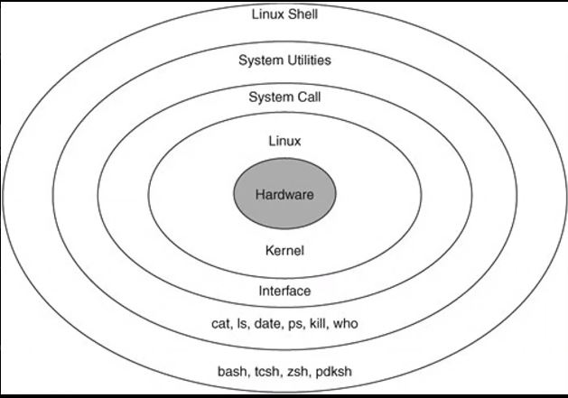
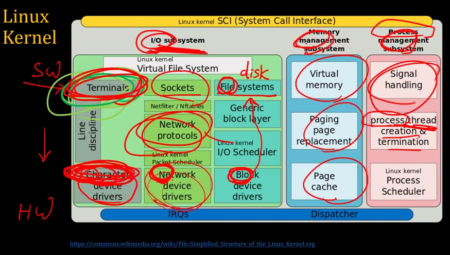

# 실전코딩 2 실습

### sshid : pcc020
### name : 윤현식
### id : 202126846
## lec02
### Computer Hardware & Software System

* CPU (Intel, AMD..)
* Memory (RAM)
* Output Devices
* Storage Devices (DISK)
* Input Devices 
* buffer
    * iobuffer (input, output device에 관여하는 buffer)

### Linux Software

* HardWare
* Linux: Kernel
* System Call: Interface
* System Utilities: cat, ls, date, ps, kill, who
* Linux Shell: bash, tsch, zsh, pdksh

### Linux kernel SCI (System Call Interface)

**그림에서 위쪽으로 갈수록 sw, 아래로 갈수록 hw.**
* Terminal (단말기): 사용자와 컴퓨터 시스템 간의 마지막 관계 -> 사용자 바로 앞의 기계 -> input, output 둘다 가능함. 
* Character deivce: 문자 장치
* 리눅스는 모든 디바이스가 파일이다.

### 컴퓨터의 구성요소 4가지
* 데이터, 소프트웨어, 하드웨어, 사용자

### Linux system & command
  
**C는 캐릭터 디바이스. l은 slink. 여기서 디바이스 pts가 14인 파일을 소유하고 있는 tty 그룹은 write할 수 있고, 나머지는 permission 할 수 없음.**

* shell에서 가장 기본이 되는 input과 output 장치: 표준입출력장치(stdio)

1. wall
   * 모든 사람에게 메세지를 보내는 명령어.
1. write + (대상)
   * 대상에게 메세지를 보내는 명령어.
1. mesg n
   * 메세지 차단.
1. man
   * manual의 약자로 명령어의 사용법을 알려주는 명령어.
1. ctrl + c
   * kill의 효과를 가지고 있는 명령어.
1. ctrl + d
   * 파일을 끝내는 명령어.
1. cp
   * 파일과 디렉토리를 복사할 수 있는 명령어.
1. mv
   * 파일과 디렉토리를 옮기는 명령어.
1. ps
   * 현재 돌아가고 있는 process를 확인할 수 있는 명령어. -al을 붙이면 숨겨진 파일까지 확인 가능.
1. vi
   1. (command mode) set number: 라인 넘버를 달아주는 명령어.
   1. (normal mode) /+[찾고자 하는 것]: 찾고자하는 것을 찾아주는 명령어.
   1. (normal mode) o: insert 모드를 진입하면서 한줄 내려가는 명령어.
1. sleep 10 ; echo 10
   * 10초 후 10을 출력하는 명령어.
   * echo는 문자열을 컴퓨터 터미널에 출력하는 명령어.
1. cat
   * 파일이 없을 경우: standard input을 받고 standard output으로 내보냄.
   * 파일이 있을 경우: 두개의 파일을 혼합함.
      * ex) cat data.txt hello.c output.txt > total.txt: 앞의 3개 파일의 결과를 total.txt에 저장.
1. fg %(number)
   * (number) 작업을 fore ground 작업으로 실시하는 명령어.
1. ()&
   * 작업을 back ground로 실시하는 명령어.
1. strings
   * 읽을 수 있는 데이터만 보여주는 명령어.
1. Redirection
   * stdioin, stdioout, stdioerr
   * < == 0<: 파일의 데이터를 명령에 입력.
   * '>' == 1>: : 명령의 결과를 파일로 저장.
   * 2>: stderr을 내보내는 명령어.
      * ex) cat hello.c hello.cpp 1> out.txt 2> err.txt: 이렇듯 에러를 저장하려면 2>을 사용해야함. (이때, hello.cpp라는 파일은 존재하지 않음.)
      
   * '>>': 명령의 결과를 파일에 추가. (기존의 것들이 삭제되지 않음.)
