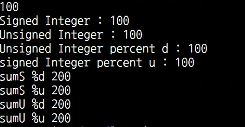
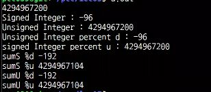
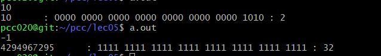

# 실전코딩 2 실습

### sshid : pcc020
### name : 윤현식
### id : 202126846

## lec05
### signed와 unsigned의 fscanf 입력
```
#include <stdio.h>
int main()
{
    signed int siA;	
	unsigned int unA;
	signed int sumS;
	unsigned int sumU;
	fscanf(stdin, "%d", &siA);
	fprintf(stdout, "Signed Inteager : %d\n", siA);
	unA = siA;
	fprintf(stdout, "Unsigned Inteager : %u\n", unA);
	fprintf(stdout, "Unsigned Inteager percent d : %d\n", unA);
	fprintf(stdout, "Unsigned Inteager percent d : %u\n", siA);

    sumS = siA + unA;
    sumU = siA + unA;
	fprintf(stdout, "sumS %%d %d\n", sumS);	
	fprintf(stdout, "sumS %%u %u\n", sumS);	
	fprintf(stdout, "sumS %%d %d\n", sumU);	
	fprintf(stdout, "sumS %%u %u\n", sumU);
```

 <br>
위 사진은 코드를 실행하고 100, -100을 넣은 결과이다.
unsigned int로 선언했더라도 출력시 %d로 받는다면 signed 형태로 받아서 나온다. 그래서 -100을 넣어도 -200이라는 sumS, sumU 출력값이 나온다.<br>
<br>
위 사진은 코드를 실행하고 4294967200을 넣은 결과이다. <br>
근데 결과를 보면 Signed int가 -96이 나온 것을 볼 수 있다. 오버플로우가 일어나지 않은 이유가 무엇일까? 우선 4294967200이 2진수로 변환하면 11111111111111111111111110100000이 된다. 그리고 scanf에 %d가 들어가면 내부적으로 strtol이 호출되는데, 이것은 변환대상이 최대값을 넘어갈 경우 long_max(0x7fffffff)을 반환한다. fscanf도 마찬가지로 내부에서 strtol 함수를 호출해서 오버플로우 현상이 일어나 입력값을 2147483647로 구겨넣는다. 하지만 64 bit os의 최대값은 0x7fffffffffffffff임으로 오버플로우가 일어나지 않는다. 그러므로 2진수로 변환된 11111111111111111111111110100000이 그대로 들어간다. 이 숫자는 96의 2의 보수이기 때문에 -96이 들어가게 되는 것이다.  <br>
반면 unsigned int는 정상 출력이 되는 것을 확인 할 수 있는데 이는 unsigned int의 범위가 0~4294967295까지이기 때문이다.

### Count number of 1 (binary)
```
#include <stdio.h>

//Count number of 1 (binary)
int count_one(int in_a)
{
        int i, count = 0;
        for(i = 31; i>=0; i--)
        {
                if((in_a>>i) & 1)
                        count++;
        }
        return count;
}

int main()
{
        int i;
        unsigned int in_a;
        fscanf(stdin, "%u", &in_a);
        fprintf(stdout, "%u \t: ", in_a);
        for(i=31; i>=0; i--)
        {
                fprintf(stdout, "%d", ((in_a>>i) & 1));
                if(i % 4==0)
                {
                        fprintf(stdout, " ");
                }
        }
        fprintf(stdout,": %d \n", count_one(in_a));
}
```
위 코드를 보면 main 함수에서 unsigned int인 in_a를 선언하고 이를 1과 & 연산을 하여 in_a의 이진수를 구한다. 그리고 if(i%4==0)이라는 조건문을 통해 4개 단위로 볼 수 있도록 출력한다. 그리고 count_one 함수에 in_a를 전달하여 똑같이 2진수 형태로 바꾸고 count += (in_a>>i)&1 연산을 통해 1의 개수를 구하고 리턴하여 main 함수에서 출력한다. <br>
하지만 코드를 좀 더 빠르게 하기 위해
```
int count_one(int in_a)
{
        int i=32, count = 0;
        while (i>0)
        {    
            count += (in_a>>i) & 1;
            i--;
        } 
        return count;
}
```
위 사진과 같이 함수를 수정하여 나타낼 수 있다. if문은 operation이 오래걸리기 때문이다. 

 <br>
사진과 같이 10과 -1을 넣었을 때 결과값을 확인할 수 있다. 이때 -1을 넣었을 때는 in_a의 출력값이 4294967295가 나오는 이유는 in_a가 unsigned int로 선언되어있기에 -1의 2진수가 그대로 들어갔고 이것이 오버플로우 없이 그대로 출력되었기 때문이다.

### The basic memory model in C 
* automatic variable (자동변수)
    * 자동 변수는 현재 블록이 끝나면 사라집니다. 즉, 변수가 생성된 뒤 자동으로 사라진다고 해서 자동 변수(automatic variable)라 부릅니다. 
* static variable (정적변수)
    * 함수 내부 및 전역에서도 사용가능하며, 각각 내부정적변수, 외부정적변수라고 불린다. 또한 0으로 자동으로 초기화된다. 프로그램 실행 시 할당되고, 자동변수와는 다르게 함수가 끝나도 그 값을 기억한다. 그리고 프로그램이 종료시 파괴된다.

* const
    * constant의 약자로 "변함없는" 이란 뜻으로 변수 앞에 붙이면 값을 변경하지 못하도록 하며, 해당 변수를 상수로 취급하게 됩니다.
