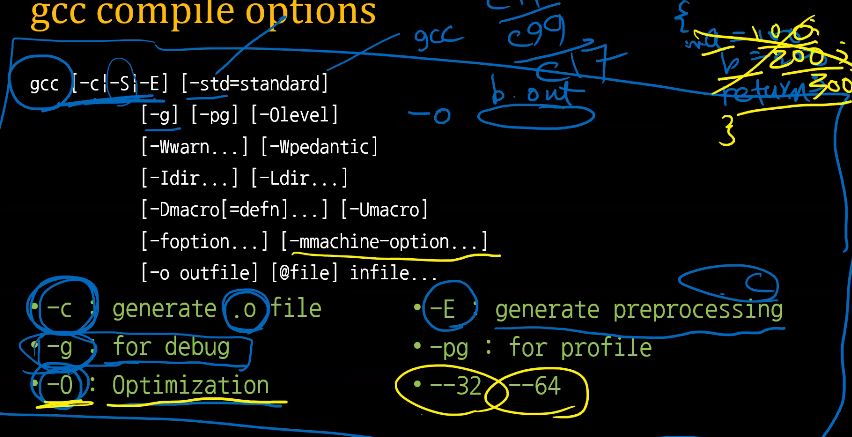
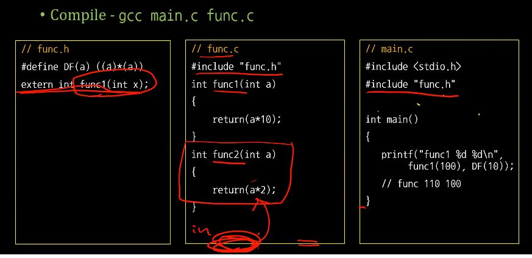

# 실전코딩 2 실습

### sshid : pcc020
### name : 윤현식
### id : 202126846

## lec07
### int const * 와 int * const의 차이
 ```
 #include <stdio.h>
 void add(int *a, int *b, int *c)
 {
     *c = *a + *b;
 }
 int main()
 {
     int const a = 100;
     int b = 200;
     int c = 9999;
     int const * p = &a;
     fprintf(stdout, "a, b ,c : %d %d %d\n", p, b, c);
     p = &b;
     fprintf(stdout, "a, b ,c : %d %d %d\n", p, b, c);
 }
```
* int const * 는 const int형을 가리키는 포인터로 포인터 값은 변경이 가능하므로 다른 것을 가리킬 수 있으나 내부의 int 값은 const로 선언되어 변경이 불가능합니다.
* int* const 는 const 포인터가 int형을 가리키고 있으므로 포인터의 값은 변경이 불가능하고 내부의 int형으로 표현된 값은 변경이 가능합니다. 

### 함수의 Pointer
```
#include <stdio.h>
//code by hyeonsik

void add( int *a, int *b, int *c)
{*c = *a + *b;}

void sub(int *a, int *b, int *c)
{*c = *a - *b;}

void div( int *a, int *b, int *c)
{*c = (*a) / (*b);}

void mul( int *a, int *b, int *c)
{*c = (*a) * (*b);}


int main()
{
        int a = 100;
        int b = 200;
        int c = 9999;
        char ch;
        int op = 0;

        scanf("%d %c %d", &a, &ch, & b);
        // ch = + add, - sub, * mul, /div
        switch (ch)
        {
                case '+':
                        op = 0;
                        break;
                case '-':
                        op = 1;
                        break;
                case '*':
                        op = 2;
                        break;
                case '/':
                        op = 3;
                        break;
        }


        void (*fp[4])(int *, int *, int *) = {add, sub, mul, div};

        if(op == 0)
        {
                fp[0](&a,&b,&c);
                fprintf(stdout, "%d\n", c);
        }

        if(op == 1){
                fp[1](&a,&b,&c);
                fprintf(stdout, "%d\n", c);
        }
        if(op == 2){
                fp[2](&a,&b,&c);
                fprintf(stdout, "%d\n", c);
        }
        if(op == 3){
                fp[3](&a,&b,&c);
                fprintf(stdout, "%d\n", c);
        }
        fprintf(stdout, "fp %lld %lld %lld %lld", add, sub, mul, div);
}
```
```
// 교수님께서 수정해주신 것.
#include <stdio.h>
#define FN_ADD 0
#define FN_SUB 1
#define FN_MUL 2
#define FN_DIV 3

void add(int *a, int *b, int *c)
{ *c = *a + *b; }

void sub(int *a, int *b, int *c)
{ *c = *a - *b; }

void mul(int *a, int *b, int *c)
{ *c = (*a) * (*b); }

void div(int *a, int *b, int *c)
{ *c = (*a) / (*b); }

int main()
{
        int a, b, c;
        char ch;
        int op = FN_ADD; // default is add

        scanf("%d %c %d", &a, &ch, &b);

        void (*fp[4])(int *, int *, int *) = {add, sub, mul, div};
        switch (ch)
        {
                case '+':
                        op = FN_ADD;
                        break;
                case '-':
                        op = FN_SUB;
                        break;
                case '*':
                        op = FN_MUL;
                        break;
                case '/':
                        op = FN_DIV;
                        break;
                default :
                        op = FN_ADD;
                        break;
        }

        fp[op](&a,&b,&c);
        fprintf(stdout, "%d \n", c);

        fp[5](&a,&b,&c);
        fprintf(stdout, "%d \n", c);

        // int const * p = &a;
        // int * const q = &a;
}
```
* 함수의 주소를 저장했다가 해당 주소의 함수를 호출할 때 사용한다.

* void (*fp)와 같이 선언한다.

* 배열은 (*fp[4])와 같이 선언한다.

* #define과 const의 차이점
    * #은 preprocessor
    * const는 타입을 가지므로 보다 표현 범위와 구조에 대해 명확하게 됩니다. 
    * const에는 메모리가 할당됩니다. 컴파일러로 하여금 그 영역에 덮어쓰는 작업을 막도록 감시하게 해 줄 뿐이지 
    주소를 직접 건드리면 const의 값 마져 변경시킬 수 있습니다.
 
### gcc compile options

### gcc compile - for multiple file
* exetern
    * 외부 파일에서 선언된 변수를 사용.
<br>

* 위 사진과 같이 코드를 짜고 gcc main.c func.c를 하게 되면 우선 #(preprocessing)이 일어나 stdio 와 func.h를 불러옵니다. 그래서 main함수에서 DF == ((a)*(a))가 되고 func.h에 있는 extern에 의해서 func.c에 있는 func1이 호출됩니다. 만약 extern이 없으면 func.c에 있는 함수를 사용할 수 없습니다.
* cc -c main.c
    * main.c를 main.o로 만들어주는 명령어.
* .o 파일
    * c 소스 프로그램을 컴파일 할 때 생기는 목적 코드 파일. 기계어로 이루어져있다.
    * cc main.o func.o를 하여도 정상적으로 a.out이 생성된다. 왜냐하면 .o에서 링크 단계를 거치면 a.out이 생성되는 것이기 때문이다.

### C Preprocessor (CPP)
* Macro Processor for C, C++, Objective-C
    * Include head files
    * Define macro
    * Conditional Compliation
    * Line Control

### CPP - include file
* #include file as text
    * #include <stdio.h> or "file.h"
* gcc Option - I
    * Include location - ./usr/include/
    * Default include location
* Prevent multiple include
    * #pragma once (두번 로딩 안함)
    * #ifndef _MATH_ <br>#include <math.h>
    <br>#endif

### CPP - Conditional Compilation
* #if, #ifdef, #ifndef, #elif, #else, #endif

* Select code with condtion
```
    * #ifdef _VERSION_<br>
      #if _VERSION_ >= 3<br>
        printf("Version is greater or equal than 3\n");<br>
        #elif _VERSTION_ == 2<br>
        #error VERSTION 2 IS NOT SUPPORTED<br>
        #endif<br>
        #endif // idfef _VERSION_
```
### Marco Definition
<br>

### 과제: if문을 이용하여 조건부 컴파일하기
```
//func.c
#define __FUNC_ 0
#define FUNCTION_NEGATIVE
extern int fun1(int x);
extern int fun2(int x);

#if __FUNC_ == 0
int func1(int a)

{
        return(a*10);
}

int func2(int a)
{
        return DF(a+1)*20;
}
#else

int func3(int a)
{
        return DF(a+2)*20;
}
#endif
```

```
// func.h
#ifndef __FUNC_

#if FUNCTION_NEGATIVE == 1
#define DF(a) (-(a)*(a))
#else
#define DF(a) ((a)*(a))
#endif

extern int func1(int x);
extern int func2(int x);
extern int func3(int x);

#endif
```
```
// main.c
#include <stdio.h>
#define FUNCTION_NEGATIVE 1
#include "func.h"
#define __FUNC_
int main()
{
        printf("func1 %d %d\n", func1(100), DF(10));// func 110 100

        printf("func2 %d %d\n", func2(100), DF(10));// func 110 100

}
```
* #if와 endif는 항상 짝을 이루어야함.
* func.h에서 extern을 통해 func.c에 있는 func1, func2, func3을 사용합니다.
* func.c에서 ```#if __FUNC_ == 0```과 #else를 통해 0일 때는 fun1, fun2의 함수를 반환하고 그 외에는 func3의 함수를 반환한다. 이때 ```__FUNC_``` 을 0 이라고 정의 해놓았기 때문에 #else 밑은 컴파일 되지 않는다.
* 그리고 main.c에서 fun1, fun2의 함수에 대입하여 결과값을 출력한다.
