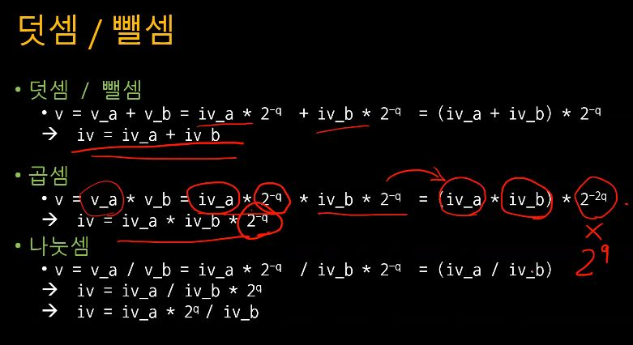
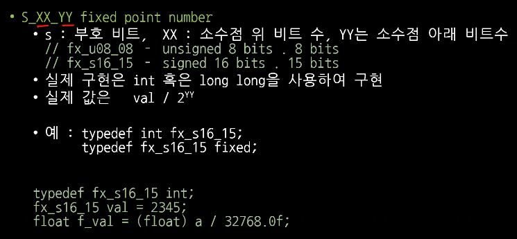
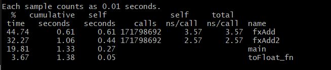
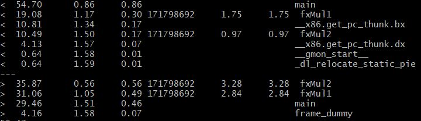

## lec10
### 숫자의 표현 flaot(IEEE 754)
* float
    * sign 1bit, exp 8 bits (bias=127), mantissa or fraction 23 bits
    * 
    * sign, exponent, fraction을 정수라고 하면
    >(sign x (-2) +1)x (1.0+fraction x 2^-23) x2^(exp-127)

### 숫자의 표현 - fixed FX_S03_04 (Q=4)
<br> 

### 덧셈/뺄셈
 <br>

### Project - Fixed Point typedef


### Project_pcc020.ver
* S_04_03
    * sign bit를 제외하고 상위 4비트를 정수부분을 표현하고, 하위 3비트를 소수부분으로 표현한다.
    * 즉, 비트 정수 n이 n/8을 나타내도록 정의. n << 3이 곧 정수.
    * 덧셈 뺄셈 구현
        * (a+b)/8
        * (a-b)/8
    * 곱셈
        * ((a x b)/8)/8
    * 나눗셈
        * ((8a)/b)/8
### What makes different performance
* Golden Rule
    * Speed - CPU > Memory > Storage > IO > Human
        * 보통 human은 연산시간에 포함 안함.
    * Register > Cache(1st, 2nd) > Memory > ...
    * Locality
    * Pipeline
        * 구성요소
        1. 빌드(Build) - 애플리케이션을 컴파일하는 단계
        1.테스트(Test) - 코드를 테스트하는 단계. 이 단계를 자동화하여 시간과 수고를 줄일 수 있습니다.
        1. 릴리스(Release) - 애플리케이션을 리포지토리에 제공하는 단계
        1. 배포(Deploy) - 코드를 프로덕션에 배포하는 단계
        1. 검증 및 컴플라이언스(Validation & compliance) - 빌드 검증 단계는 해당 조직의 필요에 따라 결정됩니다. Clair와 같은 이미지 보안 스캔 툴을 사용하여 알려진 취약점(CVE)과 비교하는 방법으로 이미지의 품질을 보장할 수 있습니다.
        * pipelining
            * 한 functional unit을 사용하는 동안 다른 unit은 아무런 일도 하고있지 않다.
            * unit이 명령어를 처리했으면 놀고있지 말고 다음 명령어를 받아와서 처리하는 방식은 어떨까? 라는 생각에서 출발하였다.
            * 한 명령어를 처리하는데 걸리는 시간은 그대로이지만 throughput(유닛이 일정한 시간에 처리하는 일의 양)을 늘려 더 빨라보이게 만든다. 실제로 더 빨라진다.
        * pipelining process
            * 
                * 위 사진과 같이 작업을 하게 되면 동시에 처리할 수 없기때문에 클럭이 12개가 필요하다.
            * 
                * 하지만 위의 사진과 같이 파이프라이닝 유사한 기법을 적용하면 동시 처리가 가능하므로 7개의 클럭만 필요로 하게된다. ++ 명령어를 세분화 할수록 더욱 빨라진다. 

    * Error
* FLOP(Floating Point Operation)
    * 플롭스(FLOPS, FLoating point Operations Per Second)는 컴퓨터의 성능을 수치로 나타낼 때 주로 사용되는 단위이다.
    * 초당 부동소수점 연산이라는 의미로 컴퓨터가 1초동안 수행할 수 있는 부동소수점 연산의 횟수를 기준으로 삼는다.
    * 연산식은 FLOPS = cores x clock x (FLOPS/cycle)이다.

### ARM Compile (optimization)
 <br>
* 숫자가 높아질수록 세부적인 최적화가 일어난다.
* 최적화 후 코드가 변경되기 때문에 디버깅을 할 수 없다. 

### gprof - GNU Profiling
* gprof - display call graph profile data 
* Compile with -pg option
    * ``` cc -pg -Wall test.c -o test```
* Execute program and generate gmon.out file
    * ```test```
* Execute gprof
    * ```gprof test gmon.out```
* gprof option
    * -b
        * 간단하게 보여줌
    * -q, -p
        * call graph or runtime
    * -z
        * add unused functions
    * -A
        * Annotation on source, must be complied with -pg, -g
    * --graph
        *
* 
    * 첫번째 열을 보면 총 걸린 시간의 %를 알 수 있다.
    * self를 통해 함수 안에서 발생한 연산 시간을 알 수 있다.
    * gprof할 때 충분히 많은 call이 필요하고 함수 호출은 굉장히 비싸다.
    * 10~20%의 오차가 항상 발생한다.
    * 
        * diff를 통해 비교해 본 결과 64bit가 32bit 보다 빠르다는 것을 알 수 있다.(위의 출력이 32bit)
