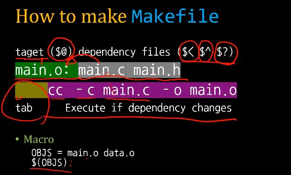

## lec12
### final_project 실행원리
1. fx_s4_3.c에 함수를 제작
1. fx_head.h에 fx_s4_3.c에서 만든 함수를 extern함.
1. main.c에서 #include "fx_head.h"를 불러옴.
1. cc main.c fx_s4_3.c 로 컴파일 함. 

### Understanding Make 
* 여러 파일을 다양한 옵션으로 컴파일 할 때 사용.
* 기본적으로 make로 실행하면 현 재 디렉토리에 있는 Makefile을 실행하지만 make -f Makefile.2 와 같이 명령어를 입력하면 다른 Makefile들도 실행할 수 있다.
* ```target ($@) dependency files ($< $^ $?)```<br>
이를 사진으로 나타내면<br>

* make에서 컴파일 할 파일이 변경되는 경우 이미 실행 파일이 만들어져 있더라도 다시 만든다.
* touch로 timestamps을를 바꾸어주어도 다시 make 명령어를 사용할 수 있다. 이때 touch Makefile은 해당되지 앟는다. 애초에 컴파일 대상이 아니기 때문이다.
* Makefile 안에 ```clean:(enter)(tab)rm main *.o *.out``` 과 같이 정의해놓음으로써 make clean을 통해 안에 넣어둔 rm 명령어를 실행할 수 있다.
* Makefile - Macro & AutoMatic Valueables
    * Macro를 참조할 때는 소괄호나 중괄호를 둘러싸고 앞에 $를 붙여야된다.
    * $@: 현재 target의 이름
    * $^: 현재 target의 종속 항목 리스트
    * $<: 현재 target의 첫번째 요소
```
OBJS = main.o fx_s15_16.o
main: $(OBJS)
        cc $(OBJS) -o $@
main.o: main.c fx_head.h fx_s15_16.h
        cc -c $<
fx_s15_16.o: fx_s15_16.c fx_s15_16.h
        cc -c $<
clean:
        rm main $(OBJS)
```
이것에 대한 make 명령어 실행값이
```
cc -c main.c
cc -c fx_s15_16.c
cc main.o fx_s15_16.o -o main
```
와 같이 나타나는 것을 볼 수 있다.

### Understanding Cmake
* 요구 CMAKE 최소 버전
    ```
    CMAKE_MINIMUM_REQUIRED (VERSION 2.8)
    ```
* 프로젝트 이름 및 버전
    ```
    PROJECT("andromeda")
    SET(PROJECT_VERSION_MAJOR 0)
    SET(PROJECT_VERSION_MINOR 1)
    ```
* 빌드 형상(Configuration) 및 Makefile 생성 여부
    ```
    SET(CMAKE_BUILD_TYPE Debug)
    SET(CMAKE_VERBOSE_MAKEFILE true)
    ```
