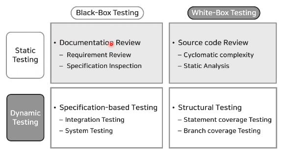

## lec15
### SW Testing
* 소프트웨어 개발 과정에서 발생할 수 있는 오류들을 가정하고, 그러한 오류들을 발견해 내는 활동
#
* [IEEE에서의 SW 테스트 정의]
    * 수동이나 자동으로 시스템을 시험 작동시키고 평가하는 작업으로 명시된 요구를 잘 만족하는지, 즉 예상된 결과와 실제 결과와의 차이를 인식하기 위한 목적을 가진다.
#
* 소프트웨어의 내부 구조 파악 여부
    * White Box
        * 소스 코드의 구조를 기반으로 테스트를 수행하는 기법
        * 코드의 수행 경로, 불필요한 코드 혹은 테스트 되지 못한 부분을 확인.
    * Black Box
        * 소프트웨어의 내부를 보지 않고 기능의 유효성을 판단하는 테스트 기법.
* 소프트웨어의 실행 여부
    * Static
        * 프로그램을 실행하지 않고 소스 코드 전체 또는 일부를 분석하는 기법.
    * Dynamic
        * SW를 실행하여 다양한 입력 값에 대해 기대하는 결과 값이 나타나는지 확인하는 테스팅 기법.

#
* V-Model
    * 시스템이나 시스템 컴포넌트 또는 소프트웨어 프로그램 등을 테스트하는 작업이 이들에 포함된 단순한 코딩의 오류만을 찾는 작업이 아니라 **요구 사항 분석에서의 오류, 설계 등 개발 단계의 작업들에 대한 테스트를 포함한다는 내용**을 **개발 프로세스와 통합화여 체계화한 개념. <br>
    V-모델은 소프트웨어 생명 주기를 모형화한 것으로 기존의 폭포수 모형에서 시스템 검증과 테스트 작업을 강조하고 있다.
    

### 소프트웨어 기능안전이란?
* 기능안전은 시스템이나 장비의 총체적 안전의 일환으로 하드웨어 고장, 소프트웨어 오류, 운영자 오류 그리고 환경적 영향 등에 대한 안전 관리를 뜻한다.
#
### 정적 테스트
* 정적 테스트란?
    * 소프트웨어를 실행시키지 않고 결함을 검출하는 방법입니다. (정적 분석, 정적 테스트는 동일한 의미로 사용됩니다.)
    * 정적 테스트는 소프트웨어 오류에 대한 특정한 판단 기준을 두고 검사를 실시합니다. 이때, 소프트웨어 검사 결과와 특정한 판단 기준을 비교하여 오류를 찾게 됩니다.
#
* 정적 테스팅 구분
    * 수동
        * 사람이 직접 SW 산출물 오류 조사
        * 'Review'방식 사용
    * 자동
        * 자동화된 테스트 도구 사용하는 방식
        * 'Syntax', 'Semantic'방식 사용.
        * Syntax는 소스코드의 문법 결함을 발견하고
        * Semamtic은 의미적인 결함을 발견합니다.
#
* 정적 테스팅 장단점
    * 장점
        1. 빠른 시간에 소프트웨어 결함 검출.
        1. 수행 노력이 작다.
    * 단점
        1. 잘못된 패턴 판단으로 False 알림 가능.
        1. 기능 동작 테스트 불가.
#
* 정적 테스트 수행 전 두 가지 이슈 사항
    1. 소프트웨어에서 검출하고자 하는 오류 유형에 알맞은 테스트 수행 방식 선정
    1. 소프트웨어에 요구되는 품질 수준에 따라 테스트 종료 기준 설정 필요.

### 동적 시스템
* 동적 시스템이란?
    * 소프트웨어 실행을 통하여 소프트웨어에 존재하는 결함을 검출하는 방법입니다.
    * 동적 테스트를 수행하기 위한 조건
    1. 소프트웨어가 실행 가능한 환경 구축.
    1. 소프트웨어를 실행하기 위한 입력, 수행 결과를 관찰하기 위한 방법.
#
* 동적 테스트의 구성 요소
    1. 테스트 케이스
    1. 테스트 웨어
    1. 테스트 결과
    * 시험 단위에 따라 구분
        > 단위 동적 테스트<br>
        > 통합 동적 테스트<br>
        > 시스템 동적 테스트<br>
#
* 동적 테스트 장점과 단점
    * 장점: 소프트웨어 기능 동작에 대한 정밀한 검증 가능.
    * 단점: 테스트 수행 결과의 False 알림 빈도 낮음.
#
* 동적 테스트 수행 전 두 가지 이슈 사항
    1. 소프트웨어에서 실행시 입력할 적절한 테스트케이스 설계 전략 선정 필요.
    1. 소프트웨어에 요구되는 품질 수준에 따라 테스트 종료 기준 설정 필요.
#
* 테스트 케이스 설계 전략 세부
    * 동등 클래스 분할
        * 입력 영역을 동등 클래스 영역으로 분할. 각 클래스 별 대표 값을 선택하여 테스트 케이스를 설계하는 방법
    * 경계값 분석
        * 소프트웨어 동작 조건에 차이를 만드는 경계 근처에 있는 값을 테스트 케이스로 설계하는 방법.
    * 상태전이 기반
        * 상태 전이 모델을 기반으로 소프트웨어의 현재 상태나 변화를 발생시키는 테스트 케이스를 설계하는 방법.
    * 경로 기반
        * 수행 경로를 기반으로 구조적 테스트 케이스를 설계하는 방법.
#
* 테스트 커버리지 종류 - 단위 테스트
    * 구문 커버리지: 구문을 수행할 정도를 나타냄.
    * 조건 커버리지: 개별 조건에 대해 수행한 정도를 나타냄.
    * 결정(분기) 커버리지: 조건문, 분기문의 수행한 정도.
    * 변경 조건/결정 커버리지: 각 개별 조건이 다른 조건의 영향을 받지 않고 전체 조건의 결과에 독립적으로 미치는 영향의 정도를 나타냄.
#
* 테스트 커버리지 종류 - 통합 테스트
    * 함수 커버리지: 함수의 호출에 대해 수행한 정도를 나타냄.
    * 함수 콜 커버리지: 함수의 호출 지점에 대해 수행한 정도를 나타냄.

### test.c
```
#include <stdio.h>
/* test code for input var */

int g_var1 = 0;
void exFunc(int * var);
int inputVarTest(int a){
	int ret = 0;

	if (a == 100 && g_var1 == 10) {
		ret = 100;
	}else if(a == 50 && g_var1 ==5){
		ret =50;
	}else {
		ret =-1;
	}
	
	return ret;
}
struct strc{
	unsigned char state;
};

int bitFunc(struct strc data){


	struct strc data2;
	if((data.state & 0x02) == 0x02){ /* [CS_IGNORE=MISRA_C_2012.MISRA_C_2012_10_04;의도된 코드] */
		printf("state1 = %X\n",2);
		printf("state2 = %X\n",data.state);
		printf("state3 = %d\n",data.state);
	}else{
		printf("state4 = %X\n",0x02 & 0x02);
		printf("state5 = %X\n",data.state);
		printf("state6 = %d\n",data.state);
	}
	return 0;
}

/* test code for undefined func Stub */
int undefinedFunc(int arg);
int definedFunc(int arg){
	return (arg * 12) + (arg * 100);
}

void undefinedStubTest(int a) /* [CS_IGNORE=MISRA_C_2012.MISRA_C_2012_02_07;TEST] */
{
	int j;
	int	l;

	j = undefinedFunc(l);
	if(j == 100 ){
		j=0;

	}else{
		j=1;
	}
}

/* test code for defined func Stub */
void definedStubTest(int a)
{
	int j, l;

	j = definedFunc(a);
	if(j == 112 ){
		j=0;
	}else if(j ==336){
		j=1;
	}else{
		j=2;
	}
}


/* Test code for void pointer */
struct S {
   int m1;
   float m2;
};

int VoidPtrTest(void* arg)
{
   int ret = 0;
   struct S *ptr = (struct S*)arg;
   if (ptr->m1 == 0) {
      ret = 0;
   }else{
      ret = 1;
   }
   return ret;
}

/* test code for static local var */
void staticVarTest(){
	static int a = 0;

	if(a==0){
		a++;
		return;
	}else if(a==1){
		a=3;
		return;
	}else if(a==3){
		a++;
		return;
	}
	else
	{
		/* exception */
	}

	return;
}

void funcCall(){
	testA();
	testB();
	testC();
}
/* test code for local var - call by reference */
void localVarTest(){
	int local_var =0;
	int flag = 0;
	exFunc(&local_var);
	if(local_var == 1){
		flag = 1;
	}else if(local_var ==2){
		flag = 2;
	}else{
		flag = 0;
	}
}

/* test code for Null Check */
struct data {
	int a;
	char *b;
};

int testMe(int a, int b , char c){
	return 0;
}
int pointerTest(struct data *pData)
{
	if(pData == 0){
		return -1;
	}else if(pData->a == 0){
		return 0;
	}else if (pData->a == 1){
		return 1;
	}
	else
	{
		/* exception */
	}
	pData->b = (char *)malloc(10);
	strcpy(pData->b, "mwyun");
}


#ifdef UNIT_TARGET
/* Test code for virtual memory */

#define READ_REG(ADDR) (*(volatile unsigned long*)(ADDR))
typedef struct strname{
	int a;
}AAA;
#define REG_BASE_ADDR 0xFFE40000U
#define (*(unsigned int *)AAA) 0xFFFF0230u
typedef unsigned char	uint8_t;			// unsigned  8-bits : begins with 'b'
typedef char			int8_t;			//   signed  8-bits : begins with 'c'
typedef unsigned int	uint16_t;			// unsigned 16-bits : begins with 'w'
typedef int				int16_t;			//   signed 16-bits : begins with 'i'
typedef unsigned long	uint32_t;			// unsigned 32-bits : begins with 'u'
typedef long			int32_t;			//   signed 32-bits : begins with 'l'
typedef float           float32_t;			// single precision IEEE 754 32-bits : begins with Capital
typedef double			int64_t;

extern volatile uint32_t ulAdcColumnWriteIndex;
int virtualMemoryTest1(){
	*(uint8_t *) ((((uint32_t)0x68000000) + (((uint32_t)0x2340) * 2)) + (ulAdcColumnWriteIndex * ((uint32_t)8) )+ 0)=100;
	/*if(READ_REG(REG_BASE_ADDR)==10){
		return 10;
	}*/
	return -1;
}


void virtualMemoryTest2(void)
{
    if(AAA&0x01==0x01){}
}

/* test code for infinite loop */
int infiniteLoopTest(int arg){
	
	while(1){
		return arg;
	}
}

#endif
```
* 테스트 케이스를 추가하면서 조건을 만족시킨다.
